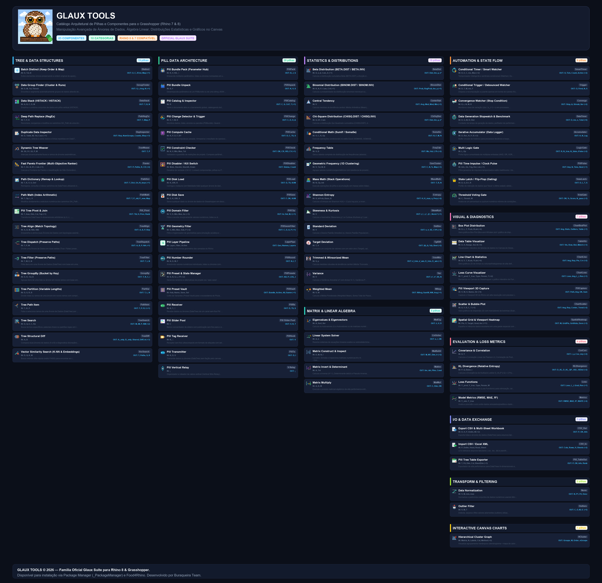

<p align="center">
  
</p>

<h1 align="center">🦉 Glaux Tools</h1>

<p align="center">
  <strong>The High-Performance Parametric Computing, Data Science & Viewport Analytics Suite for Grasshopper (Rhino 8)</strong>
</p>

<p align="center">
  <a href="https://www.rhino3d.com/"></a>
  <a href="https://www.rhino3d.com/6/features/grasshopper/"></a>
  <a href="https://dotnet.microsoft.com/"></a>
  <a href="https://github.com/jeffersonfreireribeiro-hash/glaux_tools/releases"></a>
  <a href="LICENSE"></a>
</p>

---

## 📖 Visão Geral

**Glaux Tools** é uma suíte de alta performance desenvolvida em C# nativo para o **Grasshopper / Rhino 8**, projetada para superar as limitações computacionais de fluxos paramétricos complexos. 

O plugin reúne mais de **69 componentes especializados** em cinco áreas fundamentais:
1. **💊 Arquitetura Pill**: Comunicação sem fios (*Wireless*), barramento de dados centralizado (`PillHub`), caching com hashing criptográfico (SHA-256), gerenciamento de presets e automação de layers.
2. **🌳 Engenharia de Árvores de Dados (`DataTree`)**: Diferenciação topológica estrutural (`Diff`), alinhamento de ramos, agrupamentos dinâmicos, buscas vetoriais e aritmética de caminhos.
3. **📐 Álgebra Linear & Matrizes**: Autovalores/autovetores (`Eigen`), inversão, determinantes, multiplicação matricial e resolução de sistemas lineares $A \cdot x = b$.
4. **📊 Estatística Descritiva & Aprendizado de Dados**: Matrizes de correlação/covariância, detecção de outliers (IQR e Z-Score), entropia de Shannon, divergência KL, distribuições estatísticas e funções de perda (Huber, Quantile, MAE, MSE, BCE).
5. **🗺️ Visualização de Dados & Gráficos**: Mapas de calor espaciais no viewport do Rhino (`Spatial Heatmap`), superfícies de resposta isométrica 3D, tabelas dinâmicas interativas e box plots analíticos.

<p align="center">
  
  <br>
  <em>Mapa topológico dos componentes do Glaux Tools organizados por domínio de atuação.</em>
</p>

---

## 🚀 Catálogo de Módulos e Componentes

### 1. 💊 Arquitetura Pill (Wireless & Automação Paramétrica)
Elimine o emaranhado de fios (*spaghetti code*) no canvas e implemente arquiteturas de dados desacopladas com transmissão por chave (`Key`), controle de fluxo e persistência.

| Componente | Nickname | Descrição |
| :--- | :---: | :--- |
| **Pill Hub** | `Hub` | Barramento central de dados sem fio para broadcasting e sincronização instantânea em todo o canvas. |
| **Pill Transmitter** | `Tx` | Emite dados brutos ou estruturados via canal nomeado sem fios com baixa latência. |
| **Pill Receiver** | `Rx` | Escuta e recebe dados transmitidos pelo `Pill Transmitter` correspondente à chave fornecida. |
| **Pill Relay** | `Relay` | Roteador vertical de sinais para organização estética e distribuição modular no canvas. |
| **Pill Cache** | `Cache` | Caching determinístico com fingerprinting geométrico SHA-256 (`PillDataFingerprint`), evitando recálculos pesados. |
| **Pill Disabler** | `KillSwitch` | Disjuntor paramétrico automático que desativa componentes downstream com base em condições lógicas. |
| **Pill Preset Vault** | `Vault` | Cofre de estados de projeto: salva, organiza e transiciona configurações completas do modelo. |
| **Pill Preset Manager** | `PresetMgr` | Interface de recuperação e interpolação contínua entre presets armazenados no `Pill Preset Vault`. |
| **Pill Slider Pool** | `SliderPool` | Orquestração e controle em lote de dezenas de Number Sliders para estudos generativos e otimizações. |
| **Pill Layer Pipeline** | `LayerPipe` | Criação dinâmica de camadas no Rhino, controle de visibilidade, bloqueio e bake paramétrico automatizado. |
| **Pill Pulse Timer** | `Clock` | Gerador não bloqueante de pulsos temporais periódicos para rotinas iterativas e animações. |
| **Pill Viewport Capture** | `Capture` | Captura automatizada de alta resolução do viewport com anotações e exportação programática. |
| **Pill View Generator** | `ViewGen` | Orientação paramétrica de câmeras, geração de vistas isométricas/ortogonais e exportação de metadados para captura 3D. |
| **Pill Domain Filter** | `DomainFilt` | Filtragem de intervalos numéricos e espaciais com máscaras booleanas para `Cull Pattern`. |
| **Pill Number Rounder** | `Rounder` | Arredondamento inteligente com suporte a casas decimais, múltiplos e tolerâncias de fabricação. |

---

### 2. 🌳 Engenharia de Árvores de Dados (`DataTree`)
Ferramentas de precisão para manipulação estrutural, diagnóstica e combinatória de ramificações complexas.

| Componente | Nickname | Descrição |
| :--- | :---: | :--- |
| **Tree Structural Diff** | `TreeDiff` | Diagnóstico visual e analítico comparando a topologia de ramos de duas árvores de dados. |
| **Tree Align Topology** | `AlignTopo` | Harmonização e sincronização forçada de caminhos entre árvores de dados heterogêneas. |
| **Tree Filter** | `TreeFilt` | Filtragem condicional que preserva rigorosamente a estrutura original das ramificações. |
| **Tree Group By** | `GroupBy` | Agrupamento dinâmico de elementos por chaves categóricas ou critérios numéricos. |
| **Tree Partition Variable** | `PartVar` | Particionamento de ramos com tamanhos variáveis definidos por lista de controle. |
| **Tree Path Item** | `PathItem` | Extração de elementos por índices de caminho explícitos sem necessidade de decomposição manual. |
| **Tree Search** | `TreeFind` | Busca vetorial e textual em árvores de dados com suporte a padrões e expressões lógicas. |
| **Path Dictionary** | `PathDict` | Dicionário $O(1)$ de caminhos: mapeia, consulta e traduz caminhos entre sistemas distintos. |
| **Path Math** | `PathMath` | Aritmética direta nos índices de caminhos (ex: $\{i+1; j \times 2\}$). |
| **Batch Distinct** | `Distinct` | Eliminação rápida de duplicatas preservando estritamente a ordem de inserção original. |
| **Dynamic Tree Weaver** | `Weaver` | Entrelaçamento dinâmico de ramificações seguindo padrões configuráveis. |
| **Duplicate Data Inspector**| `DupInspect` | Detecção forense de elementos geométricos e numéricos duplicados com tolerância customizável. |

---

### 3. 📐 Álgebra Linear & Matrizes
Operações matriciais de alto desempenho compiladas em código nativo seguro, essenciais para física, otimização e aprendizado de máquina.

| Componente | Nickname | Descrição |
| :--- | :---: | :--- |
| **Matrix Eigen** | `Eigen` | Cálculo estável de autovalores e autovetores para análise modal e componentes principais (PCA). |
| **Matrix Invert & Det** | `InvDet` | Inversão matricial de alta precisão com teste de condicionamento e cálculo de determinante. |
| **Matrix Multiply** | `MatMul` | Multiplicação de matrizes e produtos tensoriais com validação dimensional automática. |
| **Matrix Solver** | `SolveLin` | Resolução de sistemas de equações lineares ($A \cdot x = b$) via decomposição direta. |
| **Matrix Construct** | `MatBuild` | Construtor de matrizes a partir de DataTrees com inspeção de postos e dimensões. |

---

### 4. 📊 Estatística Descritiva, Probabilidade & Funções de Perda
Conjunto completo de ferramentas estatísticas e funções matemáticas de apoio à tomada de decisão projetual.

| Componente | Nickname | Descrição |
| :--- | :---: | :--- |
| **Covariance & Correlation**| `CovCorr` | Matrizes de covariância e correlação linear de Pearson e Spearman prontas para visualização. |
| **Outlier Detection** | `Outliers` | Identificação de anomalias por Z-Score e Intervalo Interquartil (IQR) com divisão limpa (In/Out). |
| **Shannon Entropy** | `Entropy` | Medição de dispersão e diversidade informacional de conjuntos de dados. |
| **KL Divergence** | `KLD` | Divergência de Kullback-Leibler para comparação de distribuições de probabilidade. |
| **Fast Pareto** | `Pareto` | Ordenação não dominada e cálculo da fronteira de Pareto para otimização multiobjetivo. |
| **Trimmed & Winsorized Mean**| `RobustMean`| Médias robustas imunes à influência de extremos e caudas pesadas. |
| **Statistical Distributions**| `Dist` | Avaliação de PDF, CDF e quantis inversos para Beta, Binomial, Chi-Square e Normal. |
| **Loss Functions** | `Losses` | Avaliação analítica de perdas: Huber, Quantile, MAE, MSE, Hinge e Binary Cross-Entropy. |
| **Model Metrics** | `Metrics` | Avaliação quantitativa de modelos: $R^2$, RMSE, MAE, MAPE e resíduos. |

---

### 5. 🗺️ Visualização de Dados & Gráficos Interativos
Transforme dados numéricos em diagnósticos visuais imediatos dentro do ambiente de modelagem.

| Componente | Nickname | Descrição |
| :--- | :---: | :--- |
| **Spatial Heatmap** | `Heatmap` | Renderização contínua de mapas de calor vetoriais sobre malhas e nuvens de pontos no viewport do Rhino. |
| **Isometric Surface Graph** | `IsoGraph` | Plotagem de superfícies de resposta 3D interativas para exploração paramétrica. |
| **Data Table Visualizer** | `TableVis` | Tabela interativa com rolagem e busca inserida diretamente no canvas do Grasshopper. |
| **Chart Box Plot** | `BoxPlot` | Diagramas analíticos de caixa e bigodes para análise de quartis e variabilidade. |
| **Hierarchical Cluster Graph**| `Dendro` | Agrupamento hierárquico aglomerativo com exibição gráfica de dendrogramas. |

---

## 🛠️ Como Compilar

### Pré-requisitos
* **Windows 10 / 11**
* **Rhino 8** (instalado em `C:\Program Files\Rhino 8`)
* **.NET SDK** (com suporte a `net48`)

### Compilação via Linha de Comando (CLI)
Clone o repositório e compile a solução em modo **Release**:

```powershell
git clone https://github.com/jeffersonfreireribeiro-hash/glaux_tools.git
cd glaux_tools
dotnet build -c Release Glaux_Tools.sln
```

O binário do plugin será gerado em:
`src/bin/Release/net48/Glaux_Tools.gha`

---

## 🔌 Instalação no Grasshopper

### Método 1: Instalação Automática em 1 Clique (Recomendado)
1. Dê um duplo-clique no arquivo [`INSTALAR.bat`](INSTALAR.bat) na raiz do repositório (ou execute `./install.ps1` no PowerShell).
2. O instalador detecta automaticamente sua pasta do Grasshopper (`%APPDATA%\Grasshopper\Libraries\Glaux\`), instala o binário oficial [`dist/Glaux_Tools.gha`](dist/Glaux_Tools.gha) com suporte a swap a quente e realiza o desbloqueio de segurança (`Unblock-File`) no Windows.
3. Abra o **Rhino 8** e inicie o **Grasshopper**. A aba **Glaux Tools** estará pronta para uso!

### Método 2: Instalação Manual
1. Baixe o arquivo pre-compilado [`dist/Glaux_Tools.gha`](dist/Glaux_Tools.gha) ou acesse a aba [Releases](https://github.com/jeffersonfreireribeiro-hash/glaux_tools/releases).
2. Copie o arquivo para a pasta oficial de componentes do Grasshopper:
   ```text
   %APPDATA%\Grasshopper\Libraries\Glaux\
   ```
3. Clique com o botão direito no arquivo `Glaux_Tools.gha`, selecione **Propriedades** e marque a caixa **Desbloquear** (*Unblock*), caso esteja visível.
4. Inicie o **Rhino 8** e abra o **Grasshopper**.

---

## 📚 Documentação Técnica Adicional
O repositório inclui a pasta [`docs/`](docs/) com **87 fichas técnicas individuais** detalhando a formulação matemática, diagramas Mermaid de fluxo de dados montante/jusante (*upstream/downstream*), contratos de conexão e exemplos práticos para cada componente.

---

## 📄 Licença
Distribuído sob a licença **MIT**. Consulte o arquivo [LICENSE](LICENSE) para obter detalhes sobre direitos e permissões de uso.

---

<p align="center">
  Desenvolvido por <strong>Jefferson Freire Ribeiro</strong> & Comunidade Glaux.
</p>