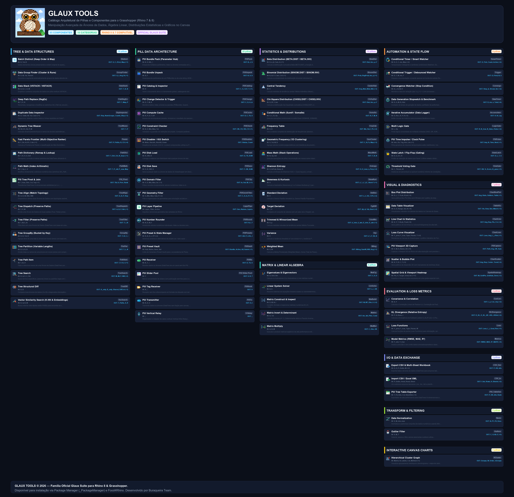

<p align="center">
  
</p>

<h1 align="center">🦉 Glaux Tools</h1>

<p align="center">
  <strong>Dados, análise, controle e visualização para definições paramétricas no Grasshopper (Rhino 8).</strong><br>
  <em>Data, analysis, control and visualization for parametric definitions in Grasshopper (Rhino 8).</em>
</p>

<p align="center">
  <a href="https://www.rhino3d.com/"></a>
  <a href="https://www.rhino3d.com/6/features/grasshopper/"></a>
  <a href="https://dotnet.microsoft.com/"></a>
  <a href="#versoes"></a>
  <a href="https://github.com/jeffersonfreireribeiro-hash/glaux_tools/actions/workflows/ci.yml"></a>
  <a href="LICENSE"></a>
</p>

<p align="center">
  <a href="#pt-br">🇧🇷 Português</a> &nbsp;·&nbsp; <a href="#english">🇺🇸 English</a>
</p>

---

<a name="pt-br"></a>

## 📖 Visão geral

O **Glaux Tools** é um plugin para **Grasshopper (Rhino 8)**, escrito em C#, com mais de 110 componentes voltados a definições paramétricas grandes e exigentes, como estudos de acústica arquitetônica, otimização multiobjetivo e análise de dados de projeto.

Ele foi pensado para três problemas comuns nesse tipo de definição:

- **Organização:** fios atravessando o canvas inteiro. O barramento sem fios **Pill** e os painéis de controle substituem dezenas de conexões e sliders espalhados.
- **Desempenho:** recálculos que não precisavam acontecer. Cache por impressão digital dos dados, notificações só quando algo realmente muda e um profiler que mostra onde o tempo de cada solução é gasto.
- **Rastreabilidade:** resultados sem registro de como foram obtidos. Snapshots, histórico e um banco de dados local guardam os parâmetros, as versões e os resultados de cada execução.

### O que o plugin oferece

1. **💊 Ecossistema Pill:** transmissão de dados sem fios pelo `PillHub`, cache de cálculos pesados, presets e variantes, controle de sliders em lote, camadas do Rhino e captura do viewport.
2. **🌳 DataTrees:** comparação e alinhamento de estruturas, filtros que preservam os caminhos, agrupamentos, busca e aritmética de caminhos.
3. **📐 Álgebra linear:** construção e inspeção de matrizes, multiplicação, inversa, determinante, sistemas lineares e autovalores.
4. **📊 Estatística e aprendizado de máquina:** distribuições de probabilidade, inferência (intervalos de confiança, ANOVA, teste F), regressão linear, métricas de classificação e validação de agrupamentos.
5. **🗺️ Visualização e desenho técnico:** gráficos no próprio canvas, mapas de calor no viewport, superfícies de resposta e pranchas vetoriais (SVG/PDF) com simbologia técnica inspirada no QGIS e na ABNT.
6. **💾 Dados, proveniência e diagnóstico:** serialização de DataTrees sem perda, banco local com revisões, snapshots do projeto, registro de experimentos e profiler de execução.
7. **🎛️ Dashboard:** painéis interativos no canvas que reúnem controles e indicadores ligados ao `PillHub`.
8. **🧪 Exploração de design:** geração de alternativas (Latin Hypercube, Sobol, grade, Morris), execução em lote na própria definição com registro no banco local e análise de sensibilidade: quais parâmetros mais pesam em cada resultado.

<a name="english"></a>

## 📖 Overview

**Glaux Tools** is a C# plugin for **Grasshopper (Rhino 8)** with more than 110 components for large, demanding parametric definitions, such as architectural acoustics studies, multi-objective optimization and design data analysis.

It targets three problems that are common in this kind of definition:

- **Organization:** wires running across the whole canvas. The **Pill** wireless bus and on-canvas control panels replace dozens of connections and scattered sliders.
- **Performance:** recomputations that did not need to happen. Fingerprint-based caching, notifications only when something actually changes, and a profiler that shows where each solution spends its time.
- **Traceability:** results with no record of how they were produced. Snapshots, history and a local database keep the parameters, versions and results of every run.

### What's inside

1. **💊 Pill ecosystem:** wireless data transmission through `PillHub`, caching of heavy computations, presets and variants, batch slider control, Rhino layers and viewport capture.
2. **🌳 DataTrees:** structural comparison and alignment, path-preserving filters, grouping, search and path arithmetic.
3. **📐 Linear algebra:** matrix construction and inspection, multiplication, inverse, determinant, linear systems and eigenvalues.
4. **📊 Statistics and machine learning:** probability distributions, inference (confidence intervals, ANOVA, F-test), linear regression, classification metrics and cluster validation.
5. **🗺️ Visualization and technical drawing:** charts drawn on the canvas, viewport heatmaps, response surfaces and vector sheets (SVG/PDF) with QGIS/ABNT-inspired technical line styles.
6. **💾 Data, provenance and diagnostics:** lossless DataTree serialization, a local database with revisions, project snapshots, experiment logging and a runtime profiler.
7. **🎛️ Dashboard:** interactive on-canvas panels that combine controls and indicators linked to `PillHub`.
8. **🧪 Design exploration:** systematic alternatives (Latin Hypercube, Sobol, grid, Morris), batch runs inside the definition with every run logged to the local database, and sensitivity analysis: which parameters drive each result.

**Quick start:** run [`INSTALAR.bat`](INSTALAR.bat) (or `install.ps1`) on Windows, or copy [`dist/Glaux_Tools.gha`](dist/Glaux_Tools.gha) to `%APPDATA%\Grasshopper\Libraries\Glaux\` and unblock the file. The **Glaux Tools** tab appears in Grasshopper after restarting Rhino 8.

> The component catalog, build instructions and technical documentation below are written in Portuguese. Each component has its own page in [`docs/`](docs/), and the design of each functional stack is described in [`docs/stacks/`](docs/stacks/).

<p align="center">
  
  <br>
  <em>Mapa dos componentes por área &nbsp;·&nbsp; Component map by area</em>
</p>

---

## 🚀 Catálogo de Módulos e Componentes

### 1. 💊 Arquitetura Pill (Wireless & Automação Paramétrica)
Elimine o emaranhado de fios (*spaghetti code*) no canvas e implemente arquiteturas de dados desacopladas com transmissão por chave (`Key`), controle de fluxo e persistência.

| Componente | Nickname | Descrição |
| :--- | :---: | :--- |
| **Pill Hub** | `Hub` | Barramento central de dados sem fio para broadcasting e sincronização instantânea em todo o canvas. |
| **Pill Transmitter** | `Tx` | Emite dados brutos ou estruturados via canal nomeado sem fios com baixa latência. |
| **Pill Receiver** | `Rx` | Escuta e recebe dados transmitidos pelo `Pill Transmitter` correspondente à chave fornecida. |
| **Pill Relay** | `Relay` | Roteador vertical de sinais para organização estética e distribuição modular no canvas. |
| **Pill Cache** | `Cache` | Caching determinístico com fingerprinting geométrico SHA-256 (`PillDataFingerprint`), evitando recálculos pesados. |
| **Pill Disabler** | `KillSwitch` | Disjuntor paramétrico automático que desativa componentes downstream com base em condições lógicas. |
| **Pill Preset Vault** | `Vault` | Cofre de estados de projeto: salva, organiza e transiciona configurações completas do modelo. |
| **Pill Preset Manager** | `PresetMgr` | Interface de recuperação e interpolação contínua entre presets armazenados no `Pill Preset Vault`. |
| **Pill Slider Pool** | `SliderPool` | Orquestração e controle em lote de dezenas de Number Sliders para estudos generativos e otimizações. |
| **Pill Layer Pipeline** | `LayerPipe` | Criação dinâmica de camadas no Rhino, controle de visibilidade, bloqueio e bake paramétrico automatizado. |
| **Pill Pulse Timer** | `Clock` | Gerador não bloqueante de pulsos temporais periódicos para rotinas iterativas e animações. |
| **Pill Viewport Capture** | `Capture` | Captura automatizada de alta resolução do viewport com anotações e exportação programática. |
| **Pill View Generator** | `ViewGen` | Orientação paramétrica de câmeras, geração de vistas isométricas/ortogonais e exportação de metadados para captura 3D. |
| **Pill Domain Filter** | `DomainFilt` | Filtragem de intervalos numéricos e espaciais com máscaras booleanas para `Cull Pattern`. |
| **Pill Number Rounder** | `Rounder` | Arredondamento inteligente com suporte a casas decimais, múltiplos e tolerâncias de fabricação. |

---

### 2. 🌳 Engenharia de Árvores de Dados (`DataTree`)
Ferramentas de precisão para manipulação estrutural, diagnóstica e combinatória de ramificações complexas.

| Componente | Nickname | Descrição |
| :--- | :---: | :--- |
| **Tree Structural Diff** | `TreeDiff` | Diagnóstico visual e analítico comparando a topologia de ramos de duas árvores de dados. |
| **Tree Align Topology** | `AlignTopo` | Harmonização e sincronização forçada de caminhos entre árvores de dados heterogêneas. |
| **Tree Filter** | `TreeFilt` | Filtragem condicional que preserva rigorosamente a estrutura original das ramificações. |
| **Tree Group By** | `GroupBy` | Agrupamento dinâmico de elementos por chaves categóricas ou critérios numéricos. |
| **Tree Partition Variable** | `PartVar` | Particionamento de ramos com tamanhos variáveis definidos por lista de controle. |
| **Tree Path Item** | `PathItem` | Extração de elementos por índices de caminho explícitos sem necessidade de decomposição manual. |
| **Tree Search** | `TreeFind` | Busca vetorial e textual em árvores de dados com suporte a padrões e expressões lógicas. |
| **Path Dictionary** | `PathDict` | Dicionário $O(1)$ de caminhos: mapeia, consulta e traduz caminhos entre sistemas distintos. |
| **Path Math** | `PathMath` | Aritmética direta nos índices de caminhos (ex: $\{i+1; j \times 2\}$). |
| **Batch Distinct** | `Distinct` | Eliminação rápida de duplicatas preservando estritamente a ordem de inserção original. |
| **Dynamic Tree Weaver** | `Weaver` | Entrelaçamento dinâmico de ramificações seguindo padrões configuráveis. |
| **Duplicate Data Inspector**| `DupInspect` | Detecção forense de elementos geométricos e numéricos duplicados com tolerância customizável. |

---

### 3. 📐 Álgebra Linear & Matrizes
Operações matriciais de alto desempenho compiladas em código nativo seguro, essenciais para física, otimização e aprendizado de máquina.

| Componente | Nickname | Descrição |
| :--- | :---: | :--- |
| **Matrix Eigen** | `Eigen` | Cálculo estável de autovalores e autovetores para análise modal e componentes principais (PCA). |
| **Matrix Invert & Det** | `InvDet` | Inversão matricial de alta precisão com teste de condicionamento e cálculo de determinante. |
| **Matrix Multiply** | `MatMul` | Multiplicação de matrizes e produtos tensoriais com validação dimensional automática. |
| **Matrix Solver** | `SolveLin` | Resolução de sistemas de equações lineares ($A \cdot x = b$) via decomposição direta. |
| **Matrix Construct** | `MatBuild` | Construtor de matrizes a partir de DataTrees com inspeção de postos e dimensões. |

---

### 4. 📊 Estatística, Inferência, Regressão & Aprendizado de Máquina
Conjunto completo cobrindo 50 formulações matemáticas canônicas de apoio à ciência de dados paramétrica e calibração de modelos:

| Componente | Nickname | Descrição |
| :--- | :---: | :--- |
| **Normal Distribution** | `NormDist` | Densidade (PDF), acumulada (CDF), quantil inverso (NORM.INV / Probit de alta precisão) e Z-Score. |
| **Poisson Distribution** | `PoissonDist` | Probabilidade pontual (PMF), cumulativa (CDF), inverso e momentos para eventos de Poisson. |
| **Probability & Bayes** | `Bayes` | Teorema de Bayes, Regras do Complementar, Adição, Multiplicação, Odds e Valor Esperado E[X]. |
| **Confidence Interval** | `ConfInterval` | Intervalo de confiança para a média (Normal Z ou t de Student), Margem de Erro E, SE e teste t/Z. |
| **ANOVA & F-Test** | `ANOVA` | ANOVA One-Way ($F = MS_{between} / MS_{within}$), razão F de variâncias e teste Qui-Quadrado ($\chi^2$). |
| **Linear Regression (OLS)** | `LinReg` | Regressão linear simples: Slope $\beta_1$, Intercept $\beta_0$, $R^2$, predições $\hat{y}$, resíduos e teste t. |
| **Classification Metrics** | `ClassMetrics` | Impureza de Gini ($1 - \sum p_i^2$), Ganho de Informação ($IG$), Odds, Logit e Sigmóide Inversa. |
| **Cluster Validation** | `ClusterEval` | Distância de Mahalanobis $D^2 = (x - \mu)^T \Sigma^{-1} (x - \mu)$ e Coeficiente de Silhueta individual/global. |
| **Covariance & Correlation**| `CovCorr` | Matrizes de covariância e correlação linear de Pearson e Spearman prontas para visualização. |
| **Outlier Detection** | `Outliers` | Identificação de anomalias por Z-Score e Intervalo Interquartil (IQR) com divisão limpa (In/Out). |
| **Shannon Entropy** | `Entropy` | Medição de dispersão e diversidade informacional de conjuntos de dados. |
| **KL Divergence** | `KLD` | Divergência de Kullback-Leibler para comparação de distribuições de probabilidade. |
| **Fast Pareto** | `Pareto` | Ordenação não dominada e cálculo da fronteira de Pareto para otimização multiobjetivo. |
| **Trimmed & Winsorized Mean**| `RobustMean`| Médias robustas imunes à influência de extremos e caudas pesadas. |
| **Statistical Distributions**| `Dist` | Avaliação de PDF, CDF e quantis inversos para Beta, Binomial e Chi-Square. |
| **Loss Functions** | `Losses` | Avaliação analítica de perdas: Huber, Quantile, MAE, MSE, Hinge e Binary Cross-Entropy. |
| **Model Metrics** | `Metrics` | Avaliação quantitativa de modelos: $R^2$, RMSE, MAE, MAPE e resíduos. |

---

### 5. 🗺️ Visualização de Dados, Desenho Técnico & Gráficos
Transforme dados numéricos em diagnósticos visuais e pranchas técnicas publicáveis dentro do ambiente de modelagem:

| Componente | Nickname | Descrição |
| :--- | :---: | :--- |
| **Pill Vector Sheet Layout** | `PillSheet` | Diagramação paramétrica de pranchas técnicas vetoriais (SVG e PDF), carimbos customizados, escalas gráficas e pré-visualização instantânea no navegador. |
| **Pill Pen Style** | `PillPen` | Estilização de linhas e simbologia vetorial inspirada no QGIS e ABNT (espessura mm, traçados, cores, preenchimento, marcadores). |
| **Pill View Generator** | `PillViewGen` | Orientador e gerador de câmeras/vistas 3D (Isométricas, Ortogonais) com Named Views automáticas. |
| **Spatial Heatmap** | `Heatmap` | Renderização contínua de mapas de calor vetoriais sobre malhas e nuvens de pontos no viewport do Rhino. |
| **Isometric Surface Graph** | `IsoGraph` | Plotagem de superfícies de resposta 3D interativas para exploração paramétrica. |
| **Data Table Visualizer** | `TableVis` | Tabela interativa com rolagem e busca inserida diretamente no canvas do Grasshopper. |
| **Chart Box Plot** | `BoxPlot` | Diagramas analíticos de caixa e bigodes para análise de quartis e variabilidade. |
| **Hierarchical Cluster Graph**| `Dendro` | Agrupamento hierárquico aglomerativo com exibição gráfica de dendrogramas. |

---

### 6. 💾 Dados, Persistência, Proveniência & Diagnóstico
Pilhas construídas sobre um núcleo compartilhado (modelo canônico de DataTree, hash de identidade exato, store local), sem dependências externas. Cada pilha tem documentação própria em [`docs/stacks/`](docs/stacks/) (arquitetura, tipos, limitações, desempenho, persistência e testes).

**I/O — Serialização de DataTrees** ([Pilha 1](docs/stacks/01_Data_Core.md)): complementa o `Import CSV` / `Export CSV` tabular existente.

| Componente | Nickname | Descrição |
| :--- | :---: | :--- |
| **Pill Tree Export** | `PillExport` | Serializa qualquer DataTree sem perda (caminhos profundos, ramos vazios, nulos, tipos mistos) em JSON tipado, CSV longo, binário Glaux ou `.pilldata`, com hash SHA-256 de identidade. |
| **Pill Tree Import** | `PillImport` | Lê os mesmos formatos (detecção automática) e reconstrói a árvore idêntica; tipos de plugins não carregados ficam opacos, sem perda ao reexportar. |
| **Pill Tree Table** | `PillTable` | Árvore → tabela colunar (path, index, type, value) para inspeção, consulta e validação. |
| **Pill Table To Tree** | `PillToTree` | Tabela colunar → árvore (operação inversa, round-trip exato). |

**Data — Store local & sincronização** ([Pilha 2](docs/stacks/02_Persistence.md)):

| Componente | Nickname | Descrição |
| :--- | :---: | :--- |
| **Pill DB Connect** | `PillDB` | Abre/cria um store `.glauxdb` (arquivo único, append-only, com revisões, CRC e recuperação após falha). |
| **Pill DB Write** | `PillDBWrite` | Grava uma DataTree como nova revisão de uma chave (sem revisão se o dado não mudou). |
| **Pill DB Read** | `PillDBRead` | Lê a última revisão ou uma revisão específica de uma chave; atualiza sozinho quando o store muda. |
| **Pill DB Query** | `PillQuery` | Consultas com filtros tipados (padrão de chave, tipo, revisões, metadados; itens por máscara de caminho, tipo, faixa e texto) — nunca consultas montadas a partir de texto. |
| **Pill Schema Inspector** | `PillSchema` | Chaves, revisões, tipos, tamanhos e saúde do store. |
| **Pill Data Validation** | `PillValidate` | Regras de tipo, nulos, duplicatas, faixa numérica e estrutura (profundidade, ramos, comprimento, ramos obrigatórios), com problemas por caminho/índice e árvore só com os itens aprovados. |
| **Pill DB Sync** | `PillSync` | Sincronização Push/Pull/Two-Way com estado explícito (Clean, LocalDirty, StoreAhead, Conflict) e sem laços GH ↔ store. |

**Vault — Proveniência do projeto** ([Pilha 3](docs/stacks/03_Project_Vault.md)): *"com quais parâmetros esse resultado foi produzido?"*

| Componente | Nickname | Descrição |
| :--- | :---: | :--- |
| **Pill Snapshot** | `PillSnap` | Captura parâmetros, sliders/toggles, canais do PillHub, entradas e resultados numa revisão do store. |
| **Pill History** | `PillHistory` | Linha do tempo das revisões (snapshots, experimentos, métricas) e extração de uma árvore de cada revisão para gráficos. |
| **Pill Compare** | `PillCompare` | Diferença entre duas revisões: parâmetros, controles e resultados alterados. |
| **Pill Restore** | `PillRestore` | Devolve os dados de uma revisão e, opcionalmente, reaplica sliders/toggles no canvas. |
| **Pill Experiment Logger** | `PillExpLog` | Registra cada execução (entradas → resultados) em lote, para otimização e estudos paramétricos. |

**Diagnostics — Desempenho** ([Pilha 4](docs/stacks/04_Diagnostics.md)):

| Componente | Nickname | Descrição |
| :--- | :---: | :--- |
| **Pill Runtime Profiler** | `PillProfiler` | Ranking de tempo por componente (média, mediana, p95), tempo da solução × componentes × Grasshopper, memória, cache e custo do próprio profiler; grava a série no store. |

### 7. 🎛️ Dashboard & Controles
Um painel no canvas no lugar de dezenas de sliders, toggles e panels ([Pilha 6](docs/stacks/06_Dashboard.md)). A definição é texto (um Panel) ou vem do Builder:

```text
title = Sala 2
layout = grid
columns = 2
slider Largura | min=4 | max=20 | step=0.5 | unit=m | key=[GEO] Largura
toggle Mostrar raios | value=true
dropdown Forro | options=Gesso;Madeira ripada;Lã mineral
number T60 | key=[ACU] T60 | unit=s | decimals=2 | min=0.6 | max=1.2
chart Fitness | key=[OPT] Fitness | span=2
```

| Componente | Nickname | Descrição |
| :--- | :---: | :--- |
| **Pill Dashboard** | `PillDash` | Painel com widgets label, number, slider, toggle, button, dropdown, progress e mini chart em layout stack/row/grid. Controles saem em V e, com `key=`, no PillHub; indicadores com `key=` mostram canais do Hub sem fios. Arrasto com commit `auto`/`live`/`release` (nada de uma solução por movimento do mouse). Estado separado da configuração: vai para o `.gh`, undo, Pill Preset Vault e Pill Snapshot/Restore. |
| **Pill Dashboard Builder** | `DashBuild` | Gera widgets a partir de listas (tipo, rótulo, configurações, valores) ou de um grupo do PillHub, e devolve a definição textual equivalente. |

### 8. 🧪 Exploração de Design
Gera alternativas de forma sistemática, roda cada uma na própria definição e mostra quais parâmetros mais pesam em cada resultado ([Pilha 7](docs/stacks/07_Exploracao_de_Design.md)):

```text
Design Space ──► Sampler ──► Batch Runner ──► Sensitivity
 (variáveis)     (amostras)   (roda e grava)    (o que pesa)
                                  └──► Fast Pareto · Pill DB Query · Pill Restore (reaplica uma execução)
```

| Componente | Nickname | Descrição |
| :--- | :---: | :--- |
| **Pill Design Space** | `DesignSpace` | Variáveis a explorar: sliders, toggles e value lists ligados por fio (ou um Pill Slider Pool / Pill Dashboard inteiro) ou escolhidos pelo nome, com faixas, passos e níveis ajustáveis (`Largura \| min=4 \| max=12 \| step=0.5`). |
| **Pill Sampler** | `Sampler` | Plano de amostras determinístico: Latin Hypercube (maximin), Sobol, aleatório, grade, trajetórias de Morris e esquema de Saltelli. |
| **Pill Batch Runner** | `Batch` | Aplica cada amostra nos controles, espera a solução e registra os resultados, sem reentrância (callback de `ScheduleSolution`). Pausa, retoma, sobrevive a salvar/reabrir o `.gh`, restaura os controles no fim e grava cada execução no store com os controles aplicados (o Pill Restore reaplica qualquer uma). |
| **Pill Sensitivity** | `Sensitivity` | Ranking das variáveis por resultado: correlação e regressão padronizada (SRC, R²), efeitos elementares de Morris (μ*, σ) ou índices de Sobol (S1, ST). |

> A auditoria que levou a essas pilhas (o que já existia, o que foi reaproveitado, dependências avaliadas, MVPs e próximas pilhas: Visualização Avançada, Animação/Timeline) está em [`docs/stacks/00_Auditoria_e_Proposta.md`](docs/stacks/00_Auditoria_e_Proposta.md).

---

<a name="versoes"></a>

## 🏷️ Histórico de Versões & Releases

| Versão | Data | Principais Novidades & Melhorias |
| :---: | :---: | :--- |
| **v1.2.1** | 30/09/2026 | **Correção no Pill Bundle Pack (Parameter Hub)**: com `Keys` e `Wires ⚡` apontando para os mesmos transmissores (o que **Conectar Cabos Ocultos** faz), cada transmissor de apelido `Pill Transmitter` ou `Tx` entrava duas vezes no pacote, sem aviso; num projeto real, 157 superfícies viravam 314. Agora um transmissor ligado nos fios não volta pela chave (a identidade é a instância, não o nome), os dois caminhos dão o mesmo nome à entrada (colhida só pela chave, `SRF_Paredes_Pill Transmitter` passa a `SRF_Paredes`) e `Keys` é opcional quando há fios, inclusive em arquivos antigos. Nomes, apelidos e GUIDs dos componentes não mudam. |
| **v1.2.0** | 30/09/2026 | **Exploração de Design**: 4 componentes novos no painel `Explore`: `Pill Design Space` (variáveis a partir de sliders, toggles, value lists, Slider Pool e Dashboard), `Pill Sampler` (Latin Hypercube, Sobol, aleatório, grade, Morris e Saltelli), `Pill Batch Runner` (roda cada alternativa na definição, com pausa, retomada e gravação no store) e `Pill Sensitivity` (correlação/SRC, Morris e índices de Sobol). Aplicação de controles pelo Pill Restore e pelo Preset Vault sem soluções extras em value lists e panels, receptores do PillHub atualizados na mesma solução e build, testes e publicação de versões automáticos no GitHub Actions. |
| **v1.1.0** | 29/09/2026 | **Pilhas Funcionais & Dashboard**: 19 componentes novos em cinco painéis: `I/O` (serialização de DataTrees sem perda em JSON, CSV, binário e `.pilldata`), `Data` (banco local `.glauxdb` com revisões, consultas, validação e sincronização), `Vault` (snapshots, histórico, comparação, restauração e registro de experimentos), `Diagnostics` (`Pill Runtime Profiler`) e `Dashboard` (`Pill Dashboard` e `Pill Dashboard Builder`). PillHub com menos recomputações e sem vazamento de memória ao fechar documentos, projeto de testes automatizados e introdução do README em português e inglês. |
| **v1.0.6** | 28/09/2026 | **Estabilidade do Pill Pulse Timer**: correção de reentrância ao abrir arquivos com o timer ativo. Um pulso que chega enquanto uma solução ainda está em andamento agora é reagendado para logo depois dela, em vez de disparar uma nova solução no meio da atual; falhas nesse momento viram um aviso na linha de comando do Rhino em vez de interromper a definição. |
| **v1.0.5** | 26/09/2026 | **Cobertura Integral de 50 Fórmulas Estatísticas & ML**: 8 novos componentes (`Normal Distribution`, `Poisson Distribution`, `Probability & Bayes`, `Confidence Interval & t-Score`, `ANOVA & F-Test`, `Linear Regression OLS`, `Classification & Tree Metrics` e `Cluster Validation`). Solvers analíticos de alta precisão (Acklam, Incomplete Beta/Gamma, Halley). |
| **v1.0.4** | 26/09/2026 | **Simbologia Técnica QGIS & ABNT**: Componente `Pill Pen Style` (`PillPen`) para estilização vetorial universal de curvas, pontos e polígonos com espessuras em mm, traçados técnicos e preenchimentos compatíveis com `PillSheet`. |
| **v1.0.3** | 26/09/2026 | **Diagramação de Pranchas Vetoriais**: Componente `Pill Vector Sheet Layout` (`PillSheet`) para composição paramétrica de pranchas técnicas (SVG/PDF), carimbos customizáveis, escalas gráficas e pré-visualização instantânea no navegador via HTML5. |
| **v1.0.2** | 25/09/2026 | **Automação de Câmeras & Vistas 3D**: Componente `Pill View Generator` (`ViewGen`), suporte a Named Views, capturas programáticas de alta resolução e arquivamento versionado de binários `.gha`. |
| **v1.0.1** | 24/09/2026 | **Lançamento Inicial Oficial**: 69 componentes base, arquitetura Pill Wireless desacoplada, instaladores em 1 clique (`INSTALAR.bat` / `install.ps1`) e documentação completa. |


---

## 🛠️ Como Compilar

### Pré-requisitos
* **Windows 10 / 11**
* **Rhino 8** (instalado em `C:\Program Files\Rhino 8`)
* **.NET SDK** (com suporte a `net48`)

### Compilação via Linha de Comando (CLI)
Clone o repositório e compile a solução em modo **Release**:

```powershell
git clone https://github.com/jeffersonfreireribeiro-hash/glaux_tools.git
cd glaux_tools
dotnet build -c Release Glaux_Tools.sln
```

O binário do plugin será gerado em:
`src/bin/Release/net48/Glaux_Tools.gha`

Sem o Rhino instalado (ex.: CI ou Linux), o projeto compila contra os pacotes NuGet `Grasshopper`/`RhinoCommon` automaticamente.

### Testes automatizados
O projeto [`tests/Glaux_Tools.Tests`](tests/) (xUnit, .NET 8) carrega o `.gha` compilado e testa os núcleos fora do Rhino: round-trip de DataTrees, store (revisões, corrupção, compactação), sincronização, snapshot → alteração → restauração, cache, import/export, profiler × medição de referência, o Dashboard (definição, estado, layout, política de commit durante o arrasto, formatação e contratos com os cofres) e a Exploração de Design (sequência de Sobol conferida com o scipy, índices de Sobol da função de Ishigami contra os valores analíticos, Morris, Latin Hypercube e o estado do lote). A renderização do Dashboard tem uma galeria separada em [`tests/render`](tests/render/DashboardGallery.cs).

```powershell
dotnet test tests/Glaux_Tools.Tests
```

Detalhes e limitações (geometria que exige o Rhino) em [`tests/README.md`](tests/README.md).

### Integração contínua e versões
Cada pull request e cada push na `main` compila o plugin e roda os testes no GitHub Actions, em Linux e Windows ([`ci.yml`](.github/workflows/ci.yml)). Quando a versão em `src/Glaux_Tools.csproj` muda na `main`, o workflow [`release.yml`](.github/workflows/release.yml) cria a tag `vX.Y.Z` e publica a Release com o `Glaux_Tools.gha` anexado e as notas do histórico acima. Se a tag já tiver sido criada à mão, a Release é publicada nela (com o binário de `dist/versions` quando a tag não está no commit atual). Versões antigas sem Release podem ser publicadas pelo próprio workflow (**Actions → Release → Run workflow**, com a versão e o commit), também com o binário arquivado em `dist/versions`.

---

## 🔌 Instalação no Grasshopper

### Método 1: Instalação Automática em 1 Clique (Recomendado)
1. Dê um duplo-clique no arquivo [`INSTALAR.bat`](INSTALAR.bat) na raiz do repositório (ou execute `./install.ps1` no PowerShell).
2. O instalador detecta automaticamente sua pasta do Grasshopper (`%APPDATA%\Grasshopper\Libraries\Glaux\`), instala o binário oficial [`dist/Glaux_Tools.gha`](dist/Glaux_Tools.gha) com suporte a swap a quente e realiza o desbloqueio de segurança (`Unblock-File`) no Windows.
3. Abra o **Rhino 8** e inicie o **Grasshopper**. A aba **Glaux Tools** estará pronta para uso!

### Método 2: Instalação Manual
1. Baixe o arquivo pre-compilado [`dist/Glaux_Tools.gha`](dist/Glaux_Tools.gha) ou acesse a aba [Releases](https://github.com/jeffersonfreireribeiro-hash/glaux_tools/releases).
2. Copie o arquivo para a pasta oficial de componentes do Grasshopper:
   ```text
   %APPDATA%\Grasshopper\Libraries\Glaux\
   ```
3. Clique com o botão direito no arquivo `Glaux_Tools.gha`, selecione **Propriedades** e marque a caixa **Desbloquear** (*Unblock*), caso esteja visível.
4. Inicie o **Rhino 8** e abra o **Grasshopper**.

---

## 📚 Documentação Técnica Adicional
O repositório inclui a pasta [`docs/`](docs/) com **110 fichas técnicas individuais** detalhando a formulação matemática, diagramas Mermaid de fluxo de dados montante/jusante (*upstream/downstream*), contratos de conexão e exemplos práticos para cada componente. A pasta [`docs/stacks/`](docs/stacks/) documenta as pilhas funcionais (Data Core, Persistence, Project Vault, Diagnostics, Dashboard, Exploração de Design) e a proposta das próximas.

---

## 📄 Licença
Distribuído sob a licença **MIT**. Consulte o arquivo [LICENSE](LICENSE) para obter detalhes sobre direitos e permissões de uso.

---

<p align="center">
  Desenvolvido por <strong>Jefferson Freire Ribeiro</strong> & Comunidade Glaux.
</p>