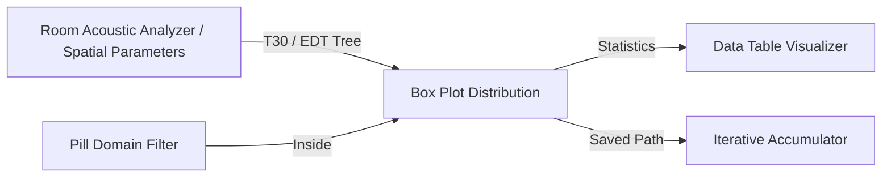

# 🧩 Box Plot Distribution (`ChartBoxPlot`)

**Categoria:** `Glaux Tools` ➔ `Visual`  
**Arquivo C#:** `ChartBoxPlot_Component.cs`  
**Classe:** `ChartBoxPlot_Component`  
**GUID:** `6a2b8b1d-3340-4f2d-a769-90008355b2e1`

---

## 📝 Descrição

Renderiza gráficos **Box Plot (Box-and-Whisker / Dispersão Populacional)** de alta resolução diretamente dentro da caixa do componente no Canvas do Grasshopper.
- Aceita dados numéricos organizados em [[DataTree]] onde cada ramo representa uma coluna/banda independente (ex: frequências de oitava de $63\text{ Hz}$ a $8\text{ kHz}$ ou múltiplos auditórios).
- Calcula analiticamente para cada grupo:
  - **Mínimo** e **Máximo**
  - **Q1** (25º percentil), **Mediana** (50º percentil) e **Q3** (75º percentil)
  - **Média** populacional
  - **IQR** (Intervalo Interquartil) e cercas de Tukey ($1.5 \times \text{IQR}$)
  - **Outliers** (marcadores de pontos extremos além dos bigodes)
- Inclui botão interativo **"📷 Salvar PNG"** para exportação imediata em 300 DPI com fundo branco pronta para relatórios técnicos, artigos e pranchas.

---

## 📥 Entradas (Inputs)

| Parâmetro | Nick | Tipo | Descrição | Padrão |
| :--- | :---: | :---: | :--- | :---: |
| **Data** | `D` | `Generic (Tree/List)` | Dados numéricos por árvore (cada ramo = uma coluna/série independente). | *Obrigatório* |
| **Labels** | `L` | `Text (List)` | Rótulos para cada coluna no eixo X (ex: `'125 Hz'`, `'250 Hz'`). Se vazio, adota caminhos. | `Opcional` |
| **Title** | `T` | `Text` | Título principal do gráfico exibido no topo. | `"Dispersão populacional..."` |
| **Y Label** | `YLab` | `Text` | Rótulo do eixo vertical Y (ex: `'Tempo de Reverberação (s)'`). | `"Valor da média"` |
| **X Label** | `XLab` | `Text` | Rótulo do eixo horizontal X (ex: `'Banda de oitava'`). | `"Banda de oitava"` |
| **Box Colors** | `Col` | `Colour (List)` | Cores de preenchimento das caixas (aceita paleta customizada ou única). | `Paleta Coral/Ardósia` |
| **Show Outliers** | `Out` | `Boolean` | Exibe marcadores circulares de outliers além dos bigodes ($1.5 \times \text{IQR}$). | `True` |
| **Export Folder** | `Folder` | `Text` | Pasta de destino para gravação do arquivo PNG. Se vazio, usa o Desktop. | `""` |
| **Save Image** | `Save` | `Boolean` | Gatilho booleano para exportar o arquivo PNG em alta resolução. | `False` |

---

## 📤 Saídas (Outputs)

| Parâmetro | Nick | Tipo | Descrição |
| :--- | :---: | :---: | :--- |
| **Chart Image** | `Img` | `Generic (Bitmap)` | Imagem renderizada do gráfico Box Plot em memória. |
| **Statistics** | `Stats` | `Number (Tree)` | Resumo estatístico por coluna: `[0]` Min, `[1]` Q1, `[2]` Mediana, `[3]` Média, `[4]` Q3, `[5]` Max, `[6]` IQR, `[7]` Desvio Padrão. |
| **Outliers** | `Outliers` | `Number (Tree)` | Lista dos valores numéricos identificados como outliers em cada coluna. |
| **Saved Path** | `Path` | `Text` | Caminho do arquivo PNG gravado em disco. |

---

## 🔗 Conexões & Compatibilidade de Pilhas (Pills)

* **Montante (Upstream):** Conecta com saídas multirramo de [[Room Acoustic Analyzer]], [[Acoustic Frequency Graph]], ou árvores filtradas de [[Pill Domain Filter]].
* **Jusante (Downstream):** Envia estatísticas numéricas para [[Data Table Visualizer]] ou exporta diretamente para relatórios.
