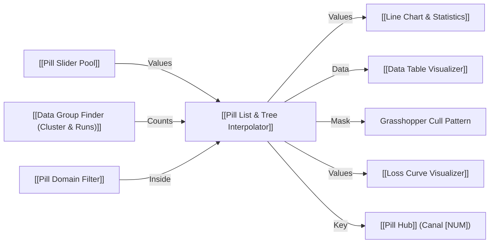

# 🧩 Data Interpolator (Gap Filler & Resampler) (`DataInterp`)

**Categoria:** `Glaux Tools` ➔ `Transform`  
**Arquivo C#:** `PillInterpolator_Component.cs`  
**Classe:** `PillInterpolator_Component`  
**GUID:** `a1100022-e1ef-4000-8000-000000000022`

---

## 📝 Descrição

Interpola e reconstrói valores numéricos contínuos em listas e árvores de dados ([[DataTree]]), preenchendo cirurgicamente lacunas (`null`, `NaN`, `Infinity`, strings vazias, `"?"`, `"-"`, `"gap"`) e reamostrando o tamanho das listas.

- **Reamostragem (Resample) e Preenchimento:** Se informado um valor alvo em `Target Count` (ex: `63`), expande ou contrai suavemente uma lista de 29 valores para exatamente 63 valores por interpolação (Linear, Cosseno, Cúbica Spline ou Degrau).
- **Particionamento por Indivíduos:** Se informada uma lista de contagens (`[N1, N2...]`), particiona a lista/árvore em ramos com o número exato de indivíduos desejados para cada parte/fatia, interpolando suavemente nós âncoras sucessivos.
- **4 Algoritmos de Interpolação:**
  - `0 = Linear`: Interpolação linear contínua tradicional ($y = y_0 + t \cdot (y_1 - y_0)$).
  - `1 = Cosine / Smooth`: Curvatura suave com aceleração/desaceleração harmônica em $S$ baseada em cosseno ($t_{smooth} = \frac{1 - \cos(\pi t)}{2}$).
  - `2 = Cubic Spline (Catmull-Rom)`: Interpolação cúbica com derivadas de borda suaves usando vizinhos secundários ($4\text{ nós}$).
  - `3 = Nearest / Step`: Mantém constante em degrau pelo vizinho conhecido mais próximo.
- **Tratamento de Bordas (Extrapolate):**
  - `0 = Clamp / Hold Edge`: Mantém constante o primeiro e último valor conhecido para lacunas nos extremos da série.
  - `1 = Linear Extrapolation`: Projeta a inclinação linear da primeira/última taxa de variação.
- **Rastreabilidade com Máscara:** Emite uma árvore booleana `Mask` (`True` = dado original existente, `False` = valor sintético/interpolado), facilitando auditoria e filtragem posterior via `Cull Pattern`.
- **Identidade Pill & Hub:** Cápsula gráfica no canvas com badge visual `[NUM]`, contador dinâmico de interpolações e publicação sem fio automática no [[Pill Hub]] via parâmetro `Key`.

---

## 📥 Entradas (Inputs)

| Parâmetro | Nick | Tipo | Descrição | Padrão |
| :--- | :---: | :---: | :--- | :---: |
| **Values** | `V` | `Generic (Tree)` | Lista ou árvore de dados ([[DataTree]]) contendo números e eventuais lacunas (`null`, `NaN`, `"?"`, `"-"`). | *Obrigatório* |
| **Target Count / Slices** | `N` | `Integer (List)` | Quantidade alvo de pontos desejada após interpolação (ex: informe `63` para reamostrar uma lista de 29 valores para exatamente 63 valores!), ou lista de contagens para particionamento. Se omitido, preserva o tamanho original preenchendo apenas as lacunas. | `[]` |
| **Method** | `M` | `Integer` | Algoritmo de interpolação: `0` = Linear, `1` = Cosseno (Smooth), `2` = Cúbico Spline, `3` = Degrau (Nearest). | `0` |
| **Extrapolate** | `Ext` | `Integer` | Tratamento de lacunas nas pontas: `0` = Clamp/Hold Edge, `1` = Extrapolação Linear. | `0` |
| **Key** | `K` | `Text` | Nome opcional do canal Pill para broadcasting sem fios automático no [[Pill Hub]] (badge `[NUM]`). | `""` |
| **Active** | `Active` | `Boolean` | Se `False`, opera em pass-through preservando a estrutura original sem interpolar. | `True` |

---

## 📤 Saídas (Outputs)

| Parâmetro | Nick | Tipo | Descrição |
| :--- | :---: | :---: | :--- |
| **Values** | `V` | `Number (Tree)` | Árvore com os valores numéricos contínuos totalmente interpolados e sem lacunas (tipo `double` / `GH_Number`). |
| **Data** | `D` | `Generic (Tree)` | Árvore de dados ([[DataTree]]) particionada em ramos conforme a quantidade de indivíduos de cada parte. |
| **Mask** | `M` | `Boolean (Tree)` | Máscara booleana paralela: `True` = dado original existente; `False` = valor interpolado / preenchido. |
| **Counts** | `C` | `Integer (List)` | Lista com a contagem real de indivíduos resultante em cada ramo/parte gerada. |
| **Gaps Filled** | `G` | `Integer` | Quantidade total de lacunas e valores ausentes preenchidos com sucesso. |

---

## 🔗 Conexões & Compatibilidade de Pilhas (Pills)

* **Montante (Upstream):** Recebe listas com ruído, lacunas ou nós de controle de [[Pill Slider Pool]], [[Pill Receiver]], contagens de agrupamento de [[Data Group Finder (Cluster & Runs)]] ou dados filtrados de [[Pill Domain Filter]].
* **Jusante (Downstream):** Alimenta diretamente [[Line Chart & Statistics]], [[Loss Curve Visualizer]], [[Data Table Visualizer]], exportação tabular via [[Export CSV & Multi-Sheet Workbook]], ou redistribui sem fios via [[Pill Hub]].
