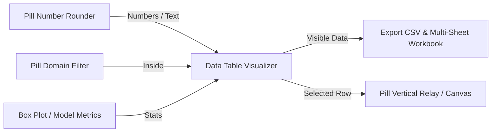

# 🧩 Data Table Visualizer (`TableViz`)

**Categoria:** `Glaux Tools` ➔ `Visual`  
**Arquivo C#:** `DataTableVisualizer_Component.cs`  
**Classe:** `DataTableVisualizer_Component`  
**GUID:** `a3f1b2c4-8e9d-4000-a000-000000000088`

---

## 📝 Descrição

Visualizador interativo de tabelas de dados em formato planilha/grid diretamente no Canvas do Grasshopper.
- Renderiza grid profissional com numeração de linhas, cabeçalho configurável e linhas com efeito zebra.
- **Fatiamento Dinâmico (Slicing):** Permite filtrar o intervalo visível por domínio numérico (ex: `'0 To 25'`, `'10..40'`) ou através de botões de navegação por páginas (Page Size).
- **Busca e Destaque Visual (Highlight):** Destaca em tempo real linhas selecionadas ou termos textuais com borda em ouro brilhante.
- Três modos de interpretação de estrutura:
  - `0 = Ramos como Colunas` (padrão)
  - `1 = Ramos como Linhas`
  - `2 = Lista Plana (Coluna Única)`
- Entrega em suas saídas a fatia de dados visíveis (`Visible Data`) e os dados da linha selecionada (`Selected Row`) para alimentar outros componentes.

---

## 📥 Entradas (Inputs)

| Parâmetro | Nick | Tipo | Descrição | Padrão |
| :--- | :---: | :---: | :--- | :---: |
| **Data** | `D` | `Generic (Tree/List)` | Árvore ou lista de dados a ser exibida na tabela. Cada ramo representa uma coluna. | *Obrigatório* |
| **Headers** | `H` | `Text (List)` | Nomes das colunas da tabela. Se omitido, gera `'Col 0, Col 1...'`. | `Opcional` |
| **Row Range** | `Range` | `Generic` | Intervalo de linhas visíveis (aceita Interval `'0 To 25'`, texto `'10..30'` ou índice). | `Paginação` |
| **Search / Select** | `Sel` | `Generic` | Índice inteiro para destacar ou palavra-chave para buscar nas colunas. | `Opcional` |
| **Page Size** | `N` | `Integer` | Quantidade de linhas visíveis por página (quando não houver `Range` explícito). | `20` |
| **Table Mode** | `Mode` | `Integer` | `0` = Ramos como Colunas, `1` = Ramos como Linhas, `2` = Lista Plana. | `0` |
| **Width** | `W` | `Integer` | Largura em pixels da tabela no canvas (mínimo: 320 px). | `520 px` |
| **Row Height** | `RowH` | `Integer` | Altura em pixels de cada linha da tabela. | `22 px` |

---

## 📤 Saídas (Outputs)

| Parâmetro | Nick | Tipo | Descrição |
| :--- | :---: | :---: | :--- |
| **Visible Data** | `Vis` | `Generic (Tree)` | Fatia de dados que está atualmente visível no intervalo filtrado. |
| **Selected Row** | `Row` | `Text (List)` | Valores de todas as colunas da linha atualmente destacada/selecionada. |
| **Selected Index** | `iSel` | `Integer` | Índice global ($0\text{-indexed}$) da linha destacada ($-1$ se nenhuma). |
| **Match Indices** | `iMatch` | `Integer (List)` | Lista dos índices de todas as linhas que atenderam ao critério de busca. |
| **Total Rows** | `Rows` | `Integer` | Contagem total de linhas da tabela completa. |

---

## 🔗 Conexões & Compatibilidade de Pilhas (Pills)

* **Montante (Upstream):** Conecta diretamente com [[Pill Number Rounder]], [[Pill Domain Filter]], [[Duplicate Data Inspector]], [[Box Plot Distribution]], e dados estatísticos.
* **Jusante (Downstream):** Alimenta [[Export CSV & Multi-Sheet Workbook]] com fatias filtradas e despacha linhas selecionadas para a modelagem no Rhino.
