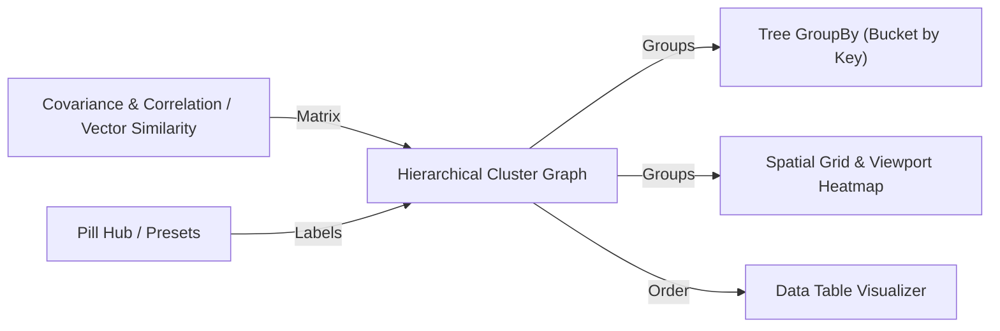

# 🧩 Hierarchical Cluster Graph (`HCluster`)

**Categoria:** `Glaux Tools` ➔ `Visual`  
**Arquivo C#:** `HierarchicalClusterGraph_Component.cs`  
**Classe:** `HierarchicalClusterGraph_Component`  
**GUID:** `b3e74c21-9a1f-4d60-ae85-5c7f23d01b88`

---

## 📝 Descrição

Visualizador interativo de **Agrupamento Hierárquico com Paridade de Risco/Peso (HRP-style)** renderizado diretamente no Canvas do Grasshopper.
- Exibe em um único painel composto:
  1. **Dendrograma de Linkage** no topo (Single, Average ou Complete Linkage).
  2. **Mapa de Calor de Correlação Reordenado** no centro (com destaque de blocos de cluster).
  3. **Barras de Peso por Grupo** na lateral direita.
  4. **Legenda de Cores** na base com estatísticas.
- **Aplicação Principal:** Agrupamento de receptores acústicos e pontos espaciais por similaridade de parâmetros acústicos (ex: $T_{30}$, $EDT$, $C_{80}$ gerados pelo [[Room Acoustic Analyzer]] ou [[Spatial Parameters]]).
- Suporta corte por altura (`Cut Height`), rotulagem de receptores e exportação PNG de alta resolução para pranchas.

---

## 📥 Entradas (Inputs)

| Parâmetro | Nick | Tipo | Descrição | Padrão |
| :--- | :---: | :---: | :--- | :---: |
| **Correlation Matrix** | `Matrix` | `Number (List/Tree)` | Matriz de correlação ou similaridade $N \times N$ (valores de 0 a 1 em lista plana row-major ou DataTree com $N$ ramos). | *Obrigatório* |
| **N (Size)** | `N` | `Integer` | Tamanho $N$ da matriz quadrada (usado quando fornecida como lista plana). | `-1 (Auto)` |
| **Labels** | `Labels` | `Text (List)` | Nomes/IDs dos nós ou receptores ($N$ strings). Se vazio, usa índices numéricos. | `Opcional` |
| **Cut Height** | `Cut` | `Number` | Altura de corte no dendrograma para definir o número de grupos. Se omitido, adota 60% da altura máxima. | `NaN (Auto)` |
| **Linkage Method** | `Method` | `Integer` | Método de linkage: `0` = Single, `1` = Average, `2` = Complete. | `0 (Single)` |
| **Title** | `Title` | `Text` | Título principal exibido no topo do gráfico. | `"Hierarchical Cluster Graph"` |
| **Subtitle** | `Sub` | `Text` | Subtítulo com detalhes (ex: método de linkage ou frequência de análise). | `"SINGLE LINKAGE..."` |
| **Caption** | `Caption` | `Text` | Texto de rodapé ou legenda explicativa. | `""` |
| **Show Weights** | `Weights` | `Boolean` | Exibe as barras de peso relativo por receptor na lateral direita. | `True` |
| **Export Path** | `PNG` | `Text` | Caminho no disco para exportar a imagem PNG. Deixe vazio para desativar exportação. | `""` |

---

## 📤 Saídas (Outputs)

| Parâmetro | Nick | Tipo | Descrição |
| :--- | :---: | :---: | :--- |
| **Cluster Assignments** | `Groups` | `Integer (List)` | Índice do grupo/cluster atribuído a cada receptor (na ordem original de entrada). |
| **Weights** | `W` | `Number (List)` | Peso normalizado por receptor (risco dividido igualmente entre grupos, e internamente). |
| **Order** | `Order` | `Integer (List)` | Permutação/reordenação ótima das folhas no dendrograma. |
| **Group Count** | `nGroups` | `Integer` | Número total de grupos/clusters formados pelo corte. |

---

## 🔗 Conexões & Compatibilidade de Pilhas (Pills)

* **Montante (Upstream):** Conecta diretamente com [[Covariance & Correlation]], [[Vector Similarity Search (K-NN & Embeddings)]] e [[Matrix Construct & Inspect]].
* **Jusante (Downstream):** Alimenta [[Tree GroupBy (Bucket by Key)]] para segregar geometrias no Rhino, e [[Spatial Grid & Viewport Heatmap]] para colorir zonas na sala.
