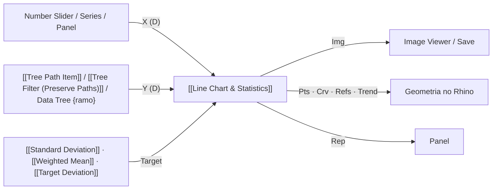
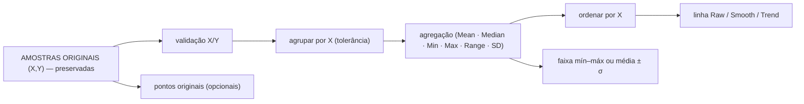

# 📈 Line Chart & Statistics (`ChartLine`) — também o "Histogram"

**GUID:** `1c2d3e4f-5a6b-7c8d-9e0f-1a2b3c4d5e6f` (inalterado) · um único componente com três tipos de gráfico.

> **Regra central:** o gráfico representa os dados, não os modifica. `X é X`, `Y é Y`; `RAW ≠ SMOOTH`; `interpolação ≠ tendência`; `histograma ≠ barras XY`; estatísticas usam os dados originais; **Canvas = PNG** (mesma cena).

## 🔗 Conexões & Compatibilidade de Pilhas (Pills)

## Fluxo de dados (um único caminho)

`Entrada GH → pares X/Y validados (ChartSeries) → estatísticas (valores originais) → ChartScene → Canvas / PNG / saídas do Rhino`.

* `ChartLineModel.cs` — pareamento, ordenação conjunta, estatísticas, PCHIP, tendência, histograma, ticks, **cena** e **mapeador** `ChartMapper` (`ScreenX = L + (X−Xmin)/(Xmax−Xmin)·W`, `ScreenY = B − (Y−Ymin)/(Ymax−Ymin)·H`).
* `ChartLineRenderer.cs` — um único `DrawPlot` usado pelo Canvas (tema escuro) e pelo PNG (tema claro). A geometria nunca depende do tema.
* `ChartLine_Component.cs` — entradas/saídas, mensagens, relatório, geometria do Rhino, menu e serialização.

## Tipos e modos (menu de contexto ou entrada `Mode`)

| Tipo (`Mode`) | Entrada | O que é desenhado |
| :--- | :--- | :--- |
| **Lines** (padrão; 0 / `lines`) | pares X/Y por ramo | **Raw** (padrão): pontos reais ordenados por X, sem suavização. **Smooth**: PCHIP (Fritsch–Carlson) — passa pelos pontos, monotônica por intervalo, **sem overshoot**, extremos locais preservados, sem extrapolar. **Trend**: dados reais sobrepostos + média móvel ponderada (kernel tricúbico, janela = 25 % dos pontos, mín. 5, máx. 2000) avaliada **só nos X originais** — combinação convexa dos Y, nunca excede o intervalo dos dados. `Mode` aceita `raw`/`smooth`/`trend`. |
| **Distribution** = Histogram (1 / `hist`/`col`/`bar`; `true`) | **observações** em Y (X ignorado, com aviso informativo) | histograma estatístico: bins de largura igual `[e_b, e_{b+1})` (último fechado), contagens, KDE opcional, limites e contagens no relatório. |
| **XYBars** (2 / `xy`/`xybars`/`bars`) | **pares explícitos** X/Y | barra em cada X com altura Y; base em Y = 0 (barras negativas crescem para baixo); largura do espaço por X = 0,8 × menor espaçamento entre X (não sobrepõe); várias séries lado a lado; X repetido divide o espaço. |

## X repetido e malhas de simulação espacial (v1.5.0)

Numa malha (p.ex. 3025 pontos de iluminância), `X = Point.X` e `Y = lux` produz **muitos Y para o mesmo X**. Isso **não é erro nem duplicata**: são posições diferentes da malha. O componente trata assim:

| Repeated X Mode (menu ou `Mode`) | Linha principal | Dispersão |
| :--- | :--- | :--- |
| **Raw** (padrão; `samples`) | só **pontos** das amostras (sem ligar em sequência: nada de zigue-zague vertical). Smooth/Trend usam a média por X apenas para o traçado | — |
| **Mean** (`mean`) | média por X | — |
| **Median** / **Minimum** / **Maximum** | mediana / mínimo / máximo por X | — |
| **Range** (`range`) | média por X | faixa translúcida mínimo–máximo (XYBars: barra de erro) |
| **Standard Deviation** (`sd`) | média por X | faixa média ± σ amostral (XYBars: barra de erro) |

* `Mode` aceita termos combinados: `xy mean`, `smooth range`, `trend median`. Sem repetição de X nada muda em nenhum modo.
* **Tolerância de agrupamento** (`GTol`; 0 = automática): single-linkage; a automática procura o maior salto (≥ 1000×) entre os espaçamentos positivos em que os menores são ruído numérico (≤ 1e-5 × escala) e fica geometricamente entre ruído e estrutura, **nunca passando de 25 % do menor espaçamento real** — colunas distintas jamais se fundem. Sem ruído usa só o épsilon 1e-9 × escala. Nada de `==` entre doubles nem arredondamento arbitrário.
* **Rastreabilidade:** a série mantém todas as amostras (X, Y, índice original); cada grupo guarda a faixa de amostras. `Rep` informa amostras originais, nº de grupos, tolerância, amostras por grupo (mín/mediana/máx), **média global × média das médias por X** (diferem quando os grupos têm tamanhos diferentes; também não assume média ponderada por área) e a tabela de grupos.
* **Amostras originais** podem ser ocultadas (menu); acima de 300 viram pontos pequenos e translúcidos (até 20 000 desenhados).
* **Aviso → observação:** "coordenadas X repetidas detectadas … comum em malhas espaciais; não é erro … grupos, tolerância, amostras retidas" (Remark). Avisos continuam para pares inválidos descartados, contagens X/Y diferentes etc.
* **XYBars:** com agregação, uma barra por X (barras de erro em Range/SD); `Raw` = barras das amostras originais lado a lado (explícito, não distribui arbitrariamente). **Histogram/Distribution:** só as observações Y (lux) em bins de iluminância; X espacial não participa. Barras de lux por posição = XYBars; histograma de lux = Distribution.
* **Data Trees:** cada ramo (`{0;0}`, `{0;1}`…) é agrupado e agregado independentemente.

### Perfil espacial (distância ao longo de uma linha)

`Sample Points` (um ponto por valor, mesma estrutura de `Y`) + `Section Curve` (+ `Section Tolerance`): cada amostra é projetada no ponto mais próximo da curva; só entram as a menos de `STol` (0 = metade do espaçamento típico da malha); `X` do gráfico = **distância ao longo da curva**, `Y` = valor original. Não interpola valores intermediários. A distância é medida em **planta (XY)** por padrão (menu: 3D, para seções verticais). Várias amostras na mesma estação (tolerância larga) viram um grupo e podem ser agregadas. Não existia outro componente de amostragem espacial no Glaux Tools para reutilizar.

## Entradas
| Parâmetro | Tipo | Descrição |
| :--- | :---: | :--- |
| **X Values** (`X`) | Number (tree) | `X[i] ↔ Y[i]` por ramo; ordenados juntos. Sem X: índice 0,1,2... Um único ramo X vale para todos os Y. Contagens diferentes = **erro** (ramo e contagens); X informado sem ramo correspondente = erro (o índice nunca substitui X). |
| **Y Values** (`Y`) | Number (tree) | Um ramo = uma série independente. No tipo Distribution são as observações. |
| Title / X Label / Y Label | Text | Rótulos. |
| **Show Stats** (`Stats`) | Boolean | Média, mediana e faixa ±1σ (valores originais). Sem conexão vale o menu. |
| Width / Height (`W`/`H`) | Integer | Tamanho do PNG. |
| **Chart Mode** (`Mode`) | Generic | Tipo/modo (ver acima). Sem conexão vale o menu. |
| **Combined Curve** (`Combined`) | Boolean | 2+ séries: média agregada por X (tracejada); Distribution: curva KDE. |
| **Target Value** (`Target`) | Generic | Valor, intervalo ou `'a To b'`: linha `Id`, faixa `Tol` e badge `Δ`. |
| **Group Tolerance** (`GTol`) | Number | *(v1.5.0)* Tolerância para X iguais; 0 = automática. |
| **Sample Points** (`Pt`) | Point (tree) | *(v1.5.0)* Perfil espacial: posição de cada amostra. |
| **Section Curve** (`Sec`) | Curve | *(v1.5.0)* Linha/curva de seção do perfil. |
| **Section Tolerance** (`STol`) | Number | *(v1.5.0)* Distância máxima à curva; 0 = automática. |

## Saídas

| Parâmetro | Tipo | Descrição |
| :--- | :---: | :--- |
| `Img` | Bitmap | PNG da mesma cena do canvas. |
| `Rep` | Text | Estatísticas por série, modo de linha, pares descartados, X fora de ordem/repetidos, bins (limites e contagens). Moda = aproximada (informativa). |
| `Pts` | Point (tree) | Pares (X,Y) por série, ordenados por X. Distribution: centro do bin × contagem. XYBars: topo das barras. |
| `Crv` | Curve (tree) | Raw = polilinha dos pontos reais; Smooth = cadeia de Béziers PCHIP exatas; Trend = polilinha da tendência; barras = retângulos. |
| `Refs` | Line (tree) | Média, mediana, moda, +σ, −σ por série; `{998}` = conjunto (2+ séries); `{999}` = alvo. |
| `GPts` | Point (tree) | *(v1.5.0)* Pontos **agregados** por X (X do grupo, valor do modo). Os originais seguem em `Pts`. |
| `Groups` | Text (tree) | *(v1.5.0)* CSV por série: `Series;Group;X;Count;Mean;Median;Min;Max;StdDev;OriginalIndices`. |
| `Trend` | Curve | 1 série: tendência. 2+ séries: média agregada por X. Distribution: KDE. Sempre polilinha (sem interpolação cúbica). |

## Causas raiz corrigidas (v1.4.0)

1. A "curva azul" era a **tendência** de kernel gaussiano desenhada grossa com um anel/ponto em **cada** ponto, mais uma curva da "moda" local — a mistura visual parecia a série principal. A curva do Rhino era `CreateInterpolatedCurve(grau 3)` sobre esses pontos (overshoot possível).
2. A série principal era desenhada **na ordem da entrada** (não por X) e translúcida; a ordenação só existia dentro do cálculo da tendência.
3. X ausente/curto caía **silenciosamente** no índice; X e Y inválidos eram descartados independentemente.
4. Histograma: o eixo Y de contagem mostrava rótulos `F0` de valores fracionários (ticks incorretos); Canvas e PNG tinham código de desenho, margens e domínios Y diferentes (8 % × 5 %).
5. Não existia modo de barras com X/Y explícitos: pares X/Y só podiam ser lidos como observações.

## Compatibilidade

* GUID, ordem e tipos de entradas/saídas mantidos. Arquivos antigos: `IsColumnsMode=true` → Distribution; "Linhas + Tendência" (curva combinada ligada) → **Trend**; sem curva combinada → **Raw**. Novos componentes: **Raw**. O arquivo continua gravando `IsColumnsMode` (versões anteriores leem o tipo).
* Mudanças de comportamento: X curto/ausente de ramo agora é erro; a curva da moda local foi removida do desenho (a moda continua no relatório e em `Refs`); `Show Stats`/`Combined` conectados vencem o menu, e sem conexão o menu passa a valer (antes o padrão persistente o sobrescrevia).

## Limitações / não coberto

* Desenho no canvas e no preview do Rhino com janela: **não testado** (o canvas usa o mesmo `DrawPlot`, verificado apenas por teste de pixels do renderizador).
* Sem eixo categórico, sem domínio manual de eixos, sem largura manual de barras, sem exportação SVG/PDF (só PNG, como antes); histograma só em contagem (não densidade/relativa).
* Trend: janela fixa de 25 % dos grupos/pontos (até 2000).
* Faixas Range/SD são poligonais entre os grupos (não suavizadas); a tolerância automática pressupõe ruído numérico muito menor que o espaçamento da malha (colunas irregulares/ruidosas exigem `GTol`).
* Perfil: distância ao ponto mais próximo da curva (curva com autointersecção/retorno pode projetar em mais de um trecho); sem interpolação entre amostras.
* Exportação de dados: menu “Exportar amostras originais e grupos (CSV)…” (`_amostras.csv` e `_grupos.csv`) e saídas `Pts`/`GPts`/`Groups`; PNG como antes (sem SVG/PDF).

Testes: `Glaux_Tools\tests\Glaux_Tools.ChartTests` (47, modelo) e `tests\rhino\Test-ChartLine.ps1` (116 + 14 de compatibilidade com a v1.3.0). Ver [[DevLog - 2026-10-08 - Line Chart e Histogram]] e [[DevLog - 2026-10-08 - Line Chart Malhas Espaciais]].