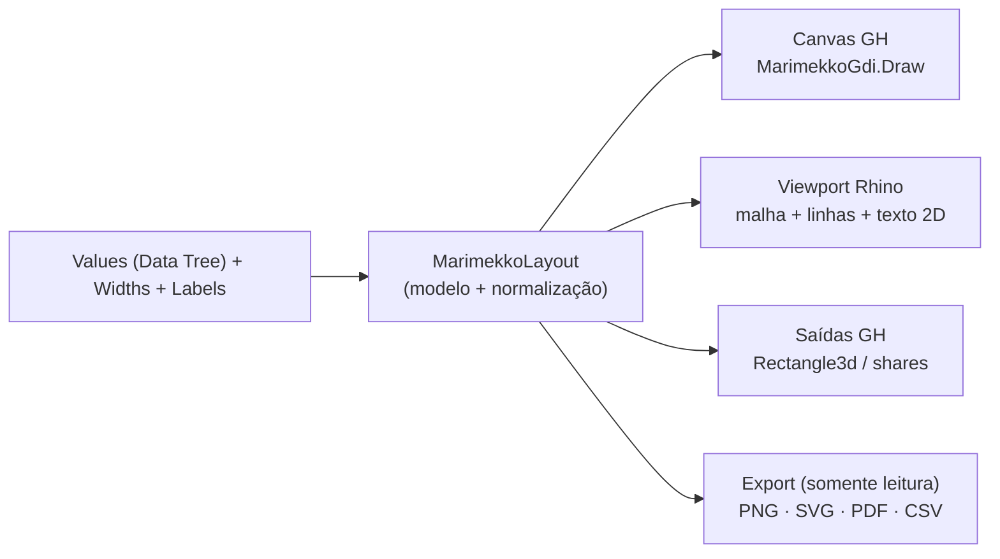

# 🧩 Marimekko Chart (`Marimekko`)

**Categoria:** `Glaux Tools` ➔ `Visual`  
**Arquivos C#:** `Marimekko_Component.cs` (componente + atributos do canvas), `MarimekkoModel.cs` (dados + normalização + layout), `MarimekkoRender.cs` (GDI+ canvas/PNG, SVG, CSV), `GlauxVectorPdf.cs`  
**GUID:** `b7110017-e1ef-4000-8000-000000000017`

## O que é um Marimekko (Mekko / Mosaic / Variable-Width Stacked Bar)

Não é um stacked bar com largura alterada. **A largura de cada coluna é um dado** e a altura de cada segmento é a composição da categoria:

```
NormalizedWidth_i  = W_i / ΣW                (largura da categoria)
NormalizedHeight_ij = V_ij / Σ_j V_ij         (segmento dentro da categoria)
CellArea_ij        = NormalizedWidth_i × NormalizedHeight_ij   (fração da ÁREA do gráfico)
```

Três valores sempre separados: **Category Share** (largura), **Segment Share** (dentro da categoria) e **Cell Area Share** (produto). Categoria = 40 % do total e segmento = 25 % da categoria → célula = **10 %** da área (nunca "25 %").

## Arquitetura: um modelo, um layout, várias representações



`MarimekkoLayout.Build` não depende de GH/Rhino/GDI+ (testável em xUnit). Canvas e PNG usam a **mesma função** `MarimekkoGdi.Draw`; SVG e PNG usam o mesmo `MarimekkoFrame` (margens, legenda, rótulos) e as mesmas regras de visibilidade de texto (`MarimekkoText`).

**Reaproveitado dos gráficos existentes:** paleta `Chart3DColumn_Component.DefaultPalette` e `ParseColors` (agora `internal`), convenção Plane + Mesh/Rectangle do 3D Column, painel escuro + botões no canvas do Box Plot, `Export Folder` + gatilho, PDF via Edge/Chrome headless (extraído do Pill Vector Sheet Layout para `GlauxVectorPdf`). **Novo:** modelo/layout (nenhum chart existente tem modelo compartilhado), SVG/CSV de gráfico (só o Sheet Layout exportava SVG).

## 📥 Entradas

| Parâmetro | Nick | Tipo | Descrição |
| :--- | :---: | :---: | :--- |
| **Values** | `V` | `Generic (Tree)` | Cada **ramo `{i}` = uma categoria**, cada item = um segmento (composição). Sem Flatten; ordem preservada. Não precisa somar 100. |
| **Category Widths** | `W` | `Generic (List)` | Valor de largura por categoria (20,55,25 ≡ 200,550,250). 1 item = larguras iguais; vazio = cada categoria usa o seu total (clássico); quantidade intermediária = **erro**. |
| **Category Labels** | `CL` | `Text (List)` | Rótulos na ordem dos ramos (padrão `Categoria n`). |
| **Segment Labels** | `SL` | `Text (List)` | Rótulos dos segmentos na ordem dos itens (padrão `Segmento n`). Mesmo segmento = mesma cor em todas as categorias. |
| **Base Plane** | `P` | `Plane` | Padrão World XY: X do plano = largura, Y = altura. |
| **Chart Size** | `Size` | `Generic` | `10`, `'10, 6'`, vetor ou ponto. Padrão 10 × 6. Só enquadra; proporções de dados permanecem exatas. |
| **Colors / Palette** | `Col` | `Generic (List)` | Cores, ou `Glaux`/`Turbo`/`Viridis`/`Jet`/`CoolWarm`. |
| **Title** | `T` | `Text` | Título opcional. |
| **Export Folder** | `Folder` | `Text` | Vazio = Área de Trabalho. |
| **Export** | `Export` | `Boolean` | Exporta **PNG + SVG + CSV** (e PDF se ligado no menu) **uma vez** na subida False→True; não escreve a cada solução. |

## 📤 Saídas

| Parâmetro | Nick | Tipo | Descrição |
| :--- | :---: | :---: | :--- |
| **Cells** | `Cells` | `Rectangle (Tree {cat}[seg])` | Retângulos das células no plano do gráfico. |
| **Chart Boundary** | `Bnd` | `Rectangle` | Limite geral. |
| **Category Share** | `CatShare` | `Number (List)` | Participação na largura (0–1). |
| **Segment Share** | `SegShare` | `Number (Tree)` | Participação no total da categoria (0–1). |
| **Cell Area Share** | `AreaShare` | `Number (Tree)` | Participação na área (0–1) = produto. |
| **Report** | `Rep` | `Text` | Invariantes e diagnósticos. |
| **Exported Files** | `Files` | `Text (List)` | Caminhos da última exportação. |

## Dados inválidos

| Caso | Comportamento |
| :--- | :--- |
| Largura ou segmento **negativo**, NaN, ∞ ou item não numérico | **Erro**, nenhuma geometria (não usa `Abs()`) |
| Largura `0` | Categoria sem largura/célula (aviso) |
| Σ larguras = 0 | Entrada inválida (erro) |
| Soma dos segmentos = 0 / ramo vazio | Categoria omitida (aviso) |
| Árvore irregular | Aviso; segmentos identificados pela **posição** no ramo (S1, S2…); ausente **não** vira 0 |

## Canvas, viewport e exportação

* **Canvas:** painel escuro com o gráfico e botões **PNG / SVG / CSV** (cada um exporta só o seu formato). Liga/desliga no menu.
* **Viewport:** malha com vertex colors (`DrawMeshFalseColors`), arestas, rótulos 2D e legenda; nada é adicionado ao documento; rótulos internos só quando a célula tem espaço em pixels.
* **SVG:** um grupo por célula (`id`, `data-category/segment/…share`, `<title>` como tooltip), legenda, rótulos, limite. **CSV:** uma linha por célula (`CategoryID, CategoryLabel, CategoryWidthValue, CategoryWidthPercent, SegmentID, SegmentLabel, SegmentValue, SegmentPercent, RelativeAreaPercent, X0, X1, Y0, Y1`; percentuais 0–100 numéricos). **PNG** 2400 × 1440 fundo branco. **PDF** vetorial (Edge/Chrome headless).
* **Menu (persistido):** modo de rótulo (Nenhum/Segmento/Valor/% do segmento/Segmento + %), legenda, rótulos de categoria, % do total sob a categoria, canvas, viewport, PDF.

## Limitações

Primeiro segmento fica embaixo (`Y0 = 0`); sem ordenação automática; sem seleção/hover (o `StableKey` = `CategoryID|SegmentID` e o `<title>` do SVG já preparam); cota/tooltip no canvas não implementado; largura/altura do gráfico no canvas segue o painel (proporções de dados exatas, aspecto do quadro livre). **Testes:** `tests/Glaux_Tools.Tests/MarimekkoModelTests.cs` (15) e `tests/rhino/Test-Marimekko.ps1` (50, RhinoCore headless; desenho com janela do Rhino/GH não testado).
