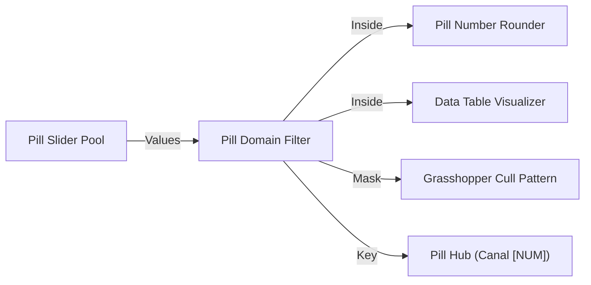

# 🧩 Pill Domain Filter (`PillClip`)

**Categoria:** `Glaux Tools` ➔ `Pills`  
**Arquivo C#:** `PillDomainFilter_Component.cs`  
**Classe:** `PillDomainFilter_Component`  
**GUID:** `a1100021-e1ef-4000-8000-000000000021`

---

## 📝 Descrição

Filtra e recorta cirurgicamente valores numéricos individuais, listas ou árvores completas ([[DataTree]]) com base em um intervalo ou domínio $[Min \text{ To } Max]$.
- **Diferencial Crítico:** Ao contrário de filtros tradicionais que retornam apenas índices, o `PillClip` entrega diretamente os **valores numéricos reais aprovados** dentro do intervalo (`Inside`) e os valores rejeitados (`Outside`).
- Suporta tanto objetos `Interval` nativos do Grasshopper (ex: `"100 To 250"`) quanto limites individuais escalares (`Min` e `Max`).
- Quatro modos operacionais flexíveis:
  - `0 = Compactar`: Remove números fora do domínio e descarta ramos vazios.
  - `1 = Preservar Ramos`: Mantém a estrutura de ramos vazios original.
  - `2 = Alinhar com Null`: Substitui valores rejeitados por `<null>` para manter alinhamento em listas paralelas.
  - `3 = Clamp / Grampear`: Em vez de descartar, fixa os valores em `Min` ou `Max`.
- Integrado à cápsula **Pill** com badge visual `[NUM]`, contadores de itens em tempo real e transmissão sem fio opcional via [[Pill Hub]].

---

## 📥 Entradas (Inputs)

| Parâmetro | Nick | Tipo | Descrição | Padrão |
| :--- | :---: | :---: | :--- | :---: |
| **Values** | `V` | `Generic (Tree)` | Valores numéricos, listas ou DataTree completa a inspecionar e filtrar. | *Obrigatório* |
| **Domain** | `D` | `Generic` | Domínio ou intervalo $[Min \text{ To } Max]$ (ex: `100 To 250`). Opcional se `Min`/`Max` forem conectados. | `Opcional` |
| **Min** | `Min` | `Number` | Limite inferior numérico aceitável (sobrescreve ou define o início do domínio). | `NaN` |
| **Max** | `Max` | `Number` | Limite superior numérico aceitável (sobrescreve ou define o fim do domínio). | `NaN` |
| **Inclusive** | `Inc` | `Boolean` | Se `True`, limites são fechados ($Min \le V \le Max$). Se `False`, estritamente abertos ($Min < V < Max$). | `True` |
| **Mode** | `M` | `Integer` | Modo de saída: `0` = Compactar, `1` = Preservar Ramos, `2` = Alinhar com Null, `3` = Clamp. | `0` |
| **Key** | `K` | `Text` | Nome do canal Pill para transmissão sem fios automática no [[Pill Hub]]. | `""` |
| **Active** | `Active` | `Boolean` | Se `False`, opera em pass-through (todos os valores passam para `Inside` sem cortes). | `True` |

---

## 📤 Saídas (Outputs)

| Parâmetro | Nick | Tipo | Descrição |
| :--- | :---: | :---: | :--- |
| **Inside** | `In` | `Number (Tree)` | Árvore com os valores numéricos reais aprovados dentro do domínio $[Min..Max]$. |
| **Outside** | `Out` | `Number (Tree)` | Árvore com os valores numéricos descartados (fora do domínio). |
| **Mask** | `M` | `Boolean (Tree)` | Máscara booleana paralela (`True` = Dentro, `False` = Fora), pronta para `Cull Pattern`. |
| **Indices** | `I` | `Integer (Tree)` | Índices originais dos itens aprovados dentro do domínio. |
| **Count** | `C` | `Integer` | Quantidade total de valores aprovados dentro do domínio. |

---

## 🔗 Conexões & Compatibilidade de Pilhas (Pills)

* **Montante (Upstream):** Conecta com [[Pill Slider Pool]], [[Pill Receiver]], resultados de simulação de [[Spatial Parameters]] ou [[Room Acoustic Analyzer]].
* **Jusante (Downstream):** Envia dados limpos para [[Pill Number Rounder]], [[Data Table Visualizer]], [[Chart Box Plot]], ou dispara via [[Pill Hub]].
