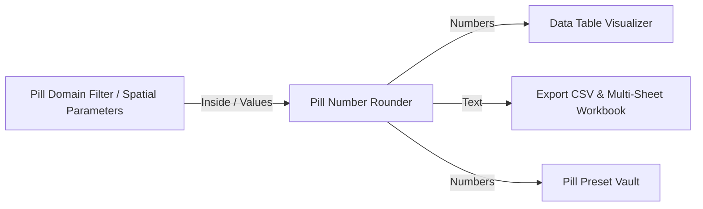

# 🧩 Pill Number Rounder (`PillRound`)

**Categoria:** `Glaux Tools` ➔ `Pills`  
**Arquivo C#:** `PillNumberRounder_Component.cs`  
**Classe:** `PillNumberRounder_Component`  
**GUID:** `a1100020-e1ef-4000-8000-000000000020`

---

## 📝 Descrição

Arredonda valores numéricos individuais, listas ou árvores completas ([[DataTree]]) com precisão configurável de casas decimais e modos flexíveis de aproximação.
- Suporta parsing automático de entradas heterogêneas (converte strings com vírgula ou ponto, números flutuantes e inteiros).
- Quatro modos matemáticos:
  - `0 = Nearest`: Arredondamento padrão para o mais próximo (Midpoint away from zero: $1.25 \rightarrow 1.3$).
  - `1 = Floor`: Arredonda sempre para baixo ($1.29 \rightarrow 1.2$).
  - `2 = Ceiling`: Arredonda sempre para cima ($1.21 \rightarrow 1.3$).
  - `3 = Truncate`: Corta as casas decimais sem arredondar.
- Três formatos simultâneos de saída: números `double` nativos para cálculos posteriores, números inteiros `int`, e texto formatado preservando zeros à direita (com opção de ponto internacional `1.20` ou vírgula brasileira `1,20` para pranchas e relatórios).

---

## 📥 Entradas (Inputs)

| Parâmetro | Nick | Tipo | Descrição | Padrão |
| :--- | :---: | :---: | :--- | :---: |
| **Numbers** | `N` | `Generic (Tree)` | Valores numéricos, listas ou árvores (DataTree) a serem arredondados. | *Obrigatório* |
| **Decimals** | `D` | `Integer` | Quantidade de casas decimais desejada (0 a 15). Se `0`, arredonda para inteiro. | `2` |
| **Mode** | `M` | `Integer` | Modo de arredondamento: `0` = Nearest, `1` = Floor, `2` = Ceiling, `3` = Truncate. | `0` |
| **Format** | `F` | `Integer` | Formato do texto: `0` = Ponto decimal (`1.23`), `1` = Vírgula decimal (`1,23`). | `0` |

---

## 📤 Saídas (Outputs)

| Parâmetro | Nick | Tipo | Descrição |
| :--- | :---: | :---: | :--- |
| **Numbers** | `N` | `Number (Tree)` | Árvore com os valores numéricos arredondados (tipo `double` / `GH_Number` nativo). |
| **Integers** | `I` | `Integer (Tree)` | Árvore com os valores convertidos para inteiros (`int` / `GH_Integer`). |
| **Text** | `T` | `Text (Tree)` | Árvore formatada como texto, preservando zeros à direita e o separador decimal escolhido. |

---

## 🔗 Conexões & Compatibilidade de Pilhas (Pills)

* **Montante (Upstream):** Conecta com saídas numéricas de [[Pill Domain Filter]], [[Pill Slider Pool]], [[Pill Receiver]], ou saídas de simulação de [[Room Acoustic Analyzer]].
* **Jusante (Downstream):** Envia dados limpos e formatados para [[Data Table Visualizer]], [[Export CSV & Multi-Sheet Workbook]], ou visualizadores de texto no Rhino.
