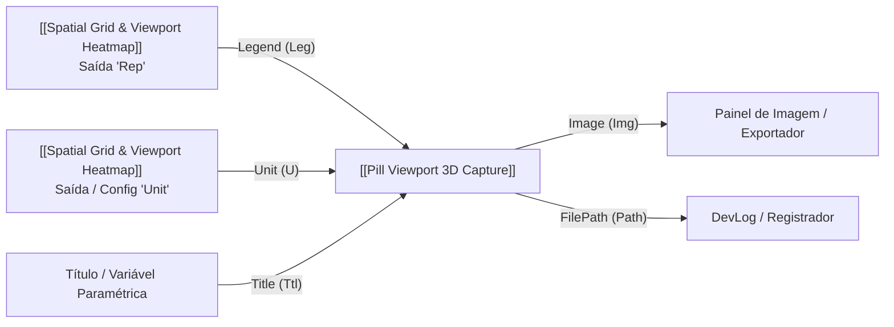

---
name: "Pill Viewport 3D Capture"
nickname: "PillCapture"
category: "Glaux Tools"
subcategory: "Visual"
class: "PillViewportCapture_Component"
file: "PillViewportCapture_Component.cs"
plugin: "Glaux Tools"
status: "Compilado / Ativo"
tags: [componente, grasshopper, glaux_tools, pills, viewport, capture, visual]
---

# 📸 Pill Viewport 3D Capture (`PillCapture`)

**Categoria:** `Glaux Tools` ➔ `Visual`  
**Arquivo C#:** `PillViewportCapture_Component.cs`  
**Classe:** `PillViewportCapture_Component`  
**GUID:** `b7110014-e1ef-4000-8000-000000000014`

---

## 📝 Descrição

Componente especializado no ecossistema **Pills** que captura o Viewport 3D do Rhino em alta definição com **preview visual em tempo real diretamente no Canvas do Grasshopper** e geração opcional em **layout editorial de publicação idêntico ao do Spatial Heatmap**, com cabeçalho, subtítulo completo de metadados, viewport enquadrado, **barra lateral de valores e unidade de medida** (sem exibir nome de paleta/escala) e rodapé estatístico.

* **Layout Editorial Científico (Padrão):** Enquadra a cena 3D em fundo branco puro editorial com moldura externa sutil, cabeçalho limpo com título customizado em negrito, unidade de medida associada (`[dB]`, `[s]`, etc.), subtítulo com metadados (pontos amostrados, grade, IDW, slope e alvo) e rodapé com valores estatísticos (`Mín`, `Média`, `Máx`, `Alvo`) e carimbo de data/hora.
* **Escala Lateral com Unidade Direta:** Renderiza à direita do modelo 3D uma barra vertical de gradiente ampla (~75% da altura da cena), com ticks numéricos precisos, marcador pontual de Alvo Ideal (`Alvo (1.45)`) e a **unidade de medida no topo da barra** (substituindo nomes de escalas como `Turbo`).
* **Preview Interativo no Canvas:** Exibe uma miniatura fiel da cena formatada no corpo do componente, exibindo o título configurado no header e botões interativos para forçar captura, salvar e abrir a pasta de destino.
* **Resoluções Customizadas:** Suporta resoluções arbitrárias (Full HD 1080p, 2K, 4K, 8K) com escalonamento vetorial proporcional de fontes, linhas e margens.
* **Modos de Exibição Dinâmicos:** Rendered, Shaded, Ghosted, Raytraced (Cycles), Technical, Artistic, Pen ou Wireframe.
* **Fundo Transparente:** Exporta imagens PNG com canal alfa perfeito quando `Transparent = True`.

---

## 📥 Entradas (Inputs)

| Parâmetro | Nick | Tipo | Descrição |
| :--- | :---: | :---: | :--- |
| **View** | `V` | `Text` | Nome do Viewport do Rhino a capturar (ex.: `'Perspective'`, `'Top'`, `'Front'`, `'Right'`). Se omitido ou vazio, captura o Viewport Ativo. |
| **Width** | `W` | `Integer` | Largura da imagem em pixels (ex.: 1920, 2560, 3840). `0` adota a largura da janela do viewport. Padrão: `1920`. |
| **Height** | `H` | `Integer` | Altura da imagem em pixels (ex.: 1080, 1440, 2160). `0` adota a altura da janela do viewport. Padrão: `1080`. |
| **FileName** | `Name` | `Text` | Nome do arquivo da imagem a salvar (ex.: `'Fachada_Principal'` ou `'Estudo_01.png'`). Padrão: `'Viewport_3D'`. |
| **Directory** | `Dir` | `Text` | Pasta de destino no disco. Se omitido, adota `'PillVault/Captures'` junto ao arquivo `.gh` atual. |
| **Display Mode** | `Mode` | `Generic` | Modo de exibição do Rhino a ser renderizado na captura: - `'Keep'` / `'Active'` (mantém o atual) - `'Rendered'` (Renderizado) - `'Shaded'` (Sombreado) - `'Ghosted'` (Fantasma) - `'Raytraced'` (Traçado de Raios) - `'Technical'` (Técnico) - `'Artistic'` (Artístico) - `'Pen'` (Caneta) - `'Wireframe'` (Aramado) |
| **Transparent** | `Trans` | `Boolean` | Fundo transparente (`True` = PNG com canal alfa transparente puro, sem moldura editorial). Padrão: `False`. |
| **Draw Grid** | `Grid` | `Boolean` | Desenhar a grade e eixos do plano de construção do viewport. Padrão: `False`. |
| **Save to Disk** | `Save` | `Boolean` | Gatilho para salvar a imagem no disco (`True` = salva arquivo). Conecte um Botão ou Toggle. Padrão: `True`. |
| **Title** | `Ttl` | `Text` | Título editorial a sobrepor no cabeçalho da imagem (ex.: `'125Hz GRID: 0.5 RAIOS: 5000000'`). Se omitido, herda automaticamente o título do `Heatmap Report` conectado em `Legend`. |
| **Font Name** | `Font` | `Text` | Família tipográfica do cabeçalho e textos (ex.: `'Segoe UI'`, `'Arial'`). Padrão: `'Segoe UI'`. |
| **Font Size** | `Sz` | `Integer` | Tamanho base da fonte do título. Padrão: `36`. |
| **Title Color** | `TCol` | `Color` | Cor do texto do título (no modo editorial com fundo branco, Branco adota automaticamente ardósia escuro `#0F172A`). |
| **Legend** | `Leg` | `Generic` | Legenda de heatmap a sobrepor na imagem. Aceita: • Saída `Report` (`Rep`) do *Spatial Grid & Viewport Heatmap* — parseia automaticamente pontos amostrados, grade, IDW, slope, limites mínimo/máximo, unidade, estatísticas e alvo. • Lista de cores (Palette Stops) — usa como barra de gradiente vertical personalizada. |
| **Unit** | `U` | `Text` | Unidade de medida a exibir junto ao título, na barra de escala e no rodapé (ex.: `'dB'`, `'s'`, `'m'`, `'°C'`). Se omitido, extrai automaticamente do Heatmap Report conectado em `'Legend'`. |

---

## 📤 Saídas (Outputs)

| Parâmetro | Nick | Tipo | Descrição |
| :--- | :---: | :---: | :--- |
| **FilePath** | `Path` | `Text` | Caminho absoluto completo do arquivo salvo no disco. |
| **Image** | `Img` | `Generic` | Objeto Bitmap em memória (`System.Drawing.Bitmap`) da captura para manipulação direta. |
| **Success** | `OK` | `Boolean` | `True` se a captura e/ou salvamento em disco foram concluídos com êxito. |
| **Summary** | `Sum` | `Text` | Relatório de metadados da captura (viewport, modo, resolução, tamanho do arquivo, timestamp). |

---

## 🔗 Conexões & Compatibilidade de Pilhas (Pills)

## 💡 Casos de Uso Práticos

1. **Documentação Automática de Estudos Paramétricos:** Integrado a um timer ou variador de parâmetros, salva capturas automáticas de cada iteração ou variante gerada no Rhino.
2. **Exportação de Diagramas Editoriais com Unidade:** Gera PNGs de modelos 3D com moldura de publicação, título, unidade de medida e gradiente lateral sincronizado com os mapas acústicos.