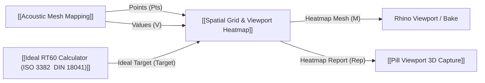

# 🧩 Spatial Grid & Viewport Heatmap (`SpatialHeatmap`)

**Categoria:** `Glaux Tools` ➔ `Visual`  
**Arquivo C#:** `SpatialHeatmap_Component.cs`  
**Classe:** `SpatialHeatmap_Component`

---

## 📝 Descrição
Espalha e interpola dados escalares em uma grade espacial com gradiente customizável, exibindo o MAPA DE CALOR DIRETAMENTE NO PAINEL DO CANVAS DO GRASSHOPPER e NO VIEWPORT 3D DO RHINO. Inclui limites manuais Min/Max, título, unidade de medida, fonte dos dados e exportação editorial.

---

## 📥 Entradas (Inputs)

| Parâmetro | Tipo | Descrição |
| :--- | :---: | :--- |
| **Sample Points** (`Pts`) | `Point` | Pontos de medição ou coordenadas dos sensores no espaço (2D ou 3D). |
| **Values** (`V`) | `Number` | Valores numéricos associados a cada ponto de medição. |
| **Ideal Target** (`Target`) | `Number` | Valor alvo ideal opcional. Quando fornecido, o gradiente avalia o desvio (|v - Target|), destacando áreas ideais. |
| **Gradient / Palette** (`Grad`) | `Generic` | Seletor de Gradiente ou Cores customizadas. Aceita:\n1. Lista de Cores personalizadas (do componente Gradient ou Swatch do GH)\n2. Número Inteiro de Preset (0 a 14)\n3. Nome do Preset ('Turbo', 'Viridis', 'Thermal', 'Plasma', 'Magma', 'Inferno', 'Target', 'TargetDiverging', 'CoolWarm', 'Cividis', 'Spectral', 'Sunset', 'Ocean', 'Forest', 'Greyscale') |
| **Invert Gradient** (`Inv`) | `Boolean` | Inverter o sentido das cores no gradiente. |
| **Resolution** (`Res`) | `Integer` | Resolução da grade/número de divisões por eixo (ex.: 35 a 100). Padrão: 40. |
| **IDW Power** (`P`) | `Number` | Expoente da ponderação pelo inverso da distância (IDW Power). Padrão: 2.0. |
| **Show in Viewport** (`Preview`) | `Boolean` | Renderizar o heatmap colorido e malha diretamente no Viewport 3D do Rhino. |
| **Z Elevation Scale** (`ZScale`) | `Generic` | Fator de elevação Z dos vértices da malha (Heatmap 3D / Landscape). Aceita:\n1. Fator multiplicador direto (ex: 1.0, 5.0, 10x) elevando a partir do valor mínimo real\n2. Domínio/Intervalo de normalização (ex: '0.2 To 2.5', Interval(0.2, 2.5) ou lista de 2 números), onde o primeiro valor é a distância vertical inicial acima da superfície/ponto (`ZMin`) e o segundo é a cota máxima (`ZMax`), interpolando com precisão os menores valores em `ZMin` e os maiores em `ZMax`. Padrão: 0.0 (plano). |
| **Chart Title** (`Title`) | `Text` | Título do mapa de calor (ex.: 'Distribuição Espacial: C80' ou 'Mapa de T30'). Se omitido, deduce automaticamente da entrada V ou adota 'Heatmap Espacial'. |
| **Unit** (`Unit`) | `Text` | Unidade de medida dos dados (ex.: 'dB', 's', '°C', '%', 'm/s'). Se omitido, deduce automaticamente se houver indicação no dado conectado. |
| **Value Limits (Min/Max)** (`Limits`) | `Generic` | Limites manuais de Mínimo e Máximo como Domínio/Intervalo (ex: Interval(0, 2) ou '0 To 2.5' ou '-25 To 25'). Se não fornecido, ajusta automaticamente à faixa real dos dados. |
| **Data Source** (`Source`) | `Text` | Fonte dos dados / metadados exibidos no rodapé do gráfico (ex: 'Pachyderm Simulation · ISO 3382', 'Medição In Situ'). |
| **Follow Slope** (`Slope`) | `Boolean` | Seguir a inclinação 3D da malha de pontos no gradiente gerado no Rhino (ex.: plateia inclinada de teatro/auditório). Quando falso, gera o gradiente em um plano horizontal nivelado (Z constante). Padrão: true. |
| **Target Tolerance & Mask** (`TolMask`) | `Generic` | Tolerância do Alvo e Máscara de Conformidade (Modo Diagnóstico do Professor).\nPermite diagnosticar visualmente o que está ABAIXO (aquém) e ACIMA (além) do alvo em gradiente tricolor (Azul = Abaixo, Vermelho = Acima) com sobreposição de MÁSCARA contrastante (Magenta, Ciano, Verde, etc.) exatamente nas áreas em conformidade com o TR ideal.\nAceita:\n- Valor de tolerância numérico ou texto (ex: 0.15 ou '10%')\n- Cor da máscara (ex: Magenta, Ciano, Swatch do GH)\n- Texto combinado (ex: '0.15 Magenta', '±10% Ciano', '0.2 Verde'). |
| **Display Mode** (`Mode`) | `Generic` | Modo de Visualização do Heatmap (Escolha entre as 3 Opções):\n0 = Gradiente Contínuo Padrão (Valores Absolutos de Mínimo a Máximo)\n1 = Desvio do Alvo (|v - Target|, de 0 a Desvio Máximo)\n2 = Diagnóstico de Alvo (Sugestão do Professor: Tricolor [Azul/Vermelho] + Máscara de Tolerância [Magenta/Ciano]).\nAceita: 0, 1, 2 ou textos ('Padrão', 'Desvio', 'Diagnóstico', 'Tricolor').\nSe não conectado: adota Modo 2 se houver Alvo e TolMask; Modo 1 se houver Alvo; ou Modo 0. |

---

## 📤 Saídas (Outputs)

| Parâmetro | Tipo | Descrição |
| :--- | :---: | :--- |
| **Heatmap Mesh** (`M`) | `Mesh` | Malha Rhino (Mesh) gerada com gradiente de cores aplicado aos vértices. |
| **Grid Points** (`GridPts`) | `Point` | Árvore de pontos amostrados da grade regular (U, V). |
| **Interpolated Values** (`GridVals`) | `Number` | Árvore de valores escalares interpolados em cada nó da grade. |
| **Target Deviations** (`Devs`) | `Number` | Árvore de desvios absolutos (|v - Target|) em relação ao valor ideal. |
| **Vertex Colors** (`Cols`) | `Colour` | Lista de cores (System.Drawing.Color) aplicadas aos vértices. |
| **Palette Stops** (`Pal`) | `Colour` | Lista de cores de parada do gradiente ativo. |
| **Heatmap Report** (`Rep`) | `Text` | Diagnóstico espacial com estatísticas de interpolação, extremos, gradiente e conformidade com o alvo. |

---

## 💡 Notas de Implementação & Uso
* **Compilação:** Mapeado na suíte `Buraqueira Tools`.
* **Testes recomendados:** Validar no Grasshopper com árvores de dados (`DataTree`) e verificar estabilidade do solver.

## 🔗 Conexões & Compatibilidade de Pilhas (Pills)

### Escala automática e validade dos dados — 2026-09-24

A escala automática usa mínimo/máximo completos; limites visuais reduzidos devem ser definidos explicitamente em Limits. A restrição automática por MAD foi retirada porque amplificava o contraste do ruído. Pts e V devem ter o mesmo tamanho. Pares não finitos são descartados juntos, com aviso; remover apenas valores pode deslocar receptores. IDW preenche espacialmente entre pares válidos, sem comprovar o TR dos receptores ausentes.
