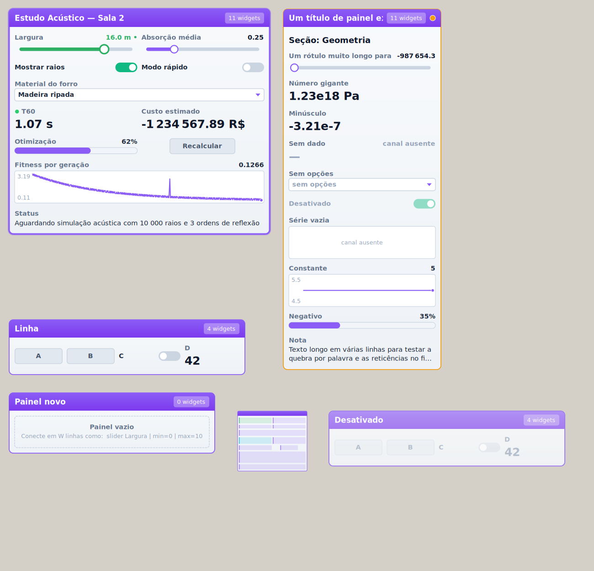
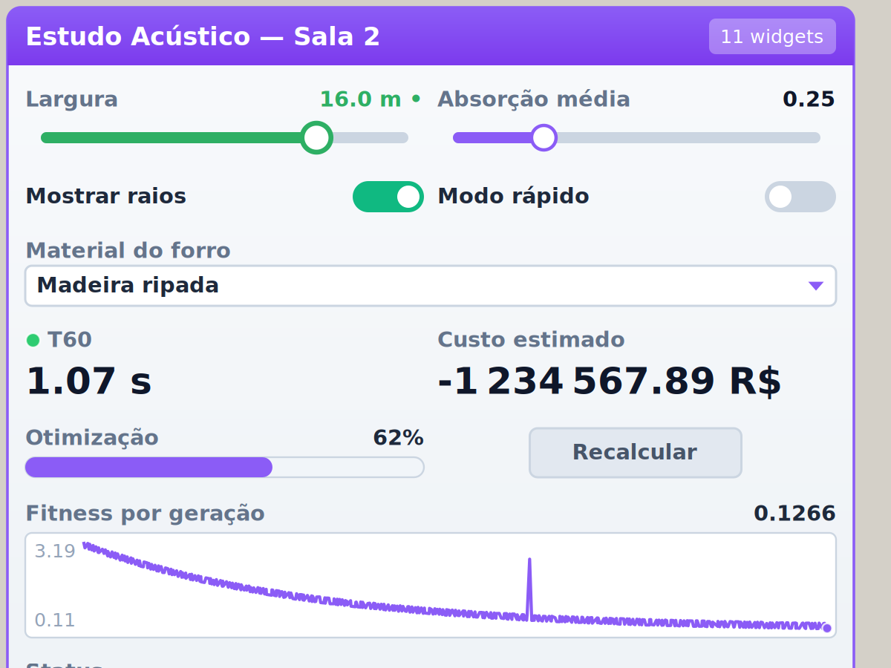

# Pilha 6 — Dashboard & Controls

## Objetivo

Reunir controles, indicadores e visualizações num painel interativo dentro do canvas, no ecossistema Pill, para não espalhar dezenas de sliders, toggles e panels pela definição:

- controles que **realmente** controlam o Grasshopper (slider, toggle, botão, dropdown), sem recomputações em cascata durante o arrasto;
- indicadores (texto, número, progresso, mini gráfico) que mostram resultados **sem fios** via PillHub;
- configuração separada do estado, para presets (Pill Preset Vault) e proveniência (Project Vault);
- uma arquitetura que cresce por widgets, sem virar um componente gigante.



*Renderização real (harness `tests/render/DashboardGallery.cs`). Na ordem: painel em grid com todos os widgets e um slider em arrasto no modo Release (valor pendente `16.0 m •`); textos longos, números gigantes e negativos, canal ausente, lista sem opções e série vazia/constante; layout em linha; painel vazio; zoom baixo (só blocos); componente desativado.*

## Infraestrutura: existente → reutilizada → nova

| Existente | Reutilizado | Novo (e por quê) |
|---|---|---|
| **PillHub**: `Publish` só notifica quando o dado muda; `TryPeekChannel` O(1) sem cópia; `NotifyReceivers` ignora a própria fonte; callbacks agendados rodam no início da solução | Controles com `key=` publicam como um Transmitter; indicadores com `key=` leem o canal na pintura; publicar **antes** do `ExpireSolution(true)` põe os receptores na mesma solução | `IPillHubPublisher`: o `PurgeOrphanChannels` só conhecia tipos fixos; agora qualquer publicador declara as próprias chaves (um ramo genérico em vez de mais um `is`) |
| **Transmitter / Receiver** | O Transmitter é o "alimentador" dos indicadores; qualquer Pill Receiver lê os controles do painel | — |
| **Pill Slider Pool** (já é um painel de controles) | Linguagem visual (cartão claro, cabeçalho violeta, trilho, switch, botão), menu de lista (`ContextMenuStrip`), undo por `RecordUndoEvent`, publicação por chave | Política de commit: o Slider Pool dispara uma solução a cada 50 ms durante o arrasto, o que em definições pesadas empilha recomputações |
| **Pill Preset Vault** | Captura de componentes monitorados | Contrato `IPillControlStateProvider`: o cofre gravava o `Write`/`Read` inteiro do componente (posição e parâmetros juntos); o painel entrega só `id=valor` |
| **Project Vault** (`ControlStateService`, `ControlCompatibility`) | Modelo `ControlState` por controle; checagem de faixa/opções antes de restaurar; aplicação numa única solução | Tipo `ControlKinds.Dashboard` e checagem de opções dos dropdowns |
| Gráficos (Chart Line e demais) | Família de fonte da interface via `GH_FontServer` (o Chart Line agora delega ao kit) | Mini Chart leve com decimação mín/máx (não some com picos) |
| `Pill_Attributes` e 4 cópias de `CreateRoundedRectangle` | Paleta, LEDs de status | **Kit visual** `PillVisualKit`: paleta, cantos, fontes em cache (os atributos atuais criam `Font` a cada pintura), trilho, switch, botão, campo, LED |
| Pulse Timer, Pill Cache | Não necessários no MVP | — |
| Desenho no viewport (`DisplayPipeline`) | Fora do MVP (ver Próximos passos) | — |

## Arquitetura

```
Pill Dashboard (GH_Component: entradas/saídas, PillHub, .gh)       Pill Dashboard Builder (listas → widgets)
   │                                                                      │
   ├─ PillDashboard_Attributes  canvas ↔ controlador: coordenadas, pintura, mouse, menus, agendamento
   │
   └─ DashboardController (puro, testado) ─────────────────────────────────────────────┐
        Configuração  DashboardSpec / WidgetSpec   (parser de texto, ida e volta, hash)   │
        Widgets       DashboardWidget + 8 tipos    (medida, zona clicável, intenção, desenho)
        Layout        DashboardLayoutEngine        (Stack / Row / Grid, padding, spacing, align)
        Estado        DashboardState               (id=valor, órfãos, presets)        │
        Interação     CommitGate + efeitos         (Live / Release / Auto, throttle)  │
        Renderização  DashboardRenderer + tema     (kit visual, nível de detalhe por zoom)
```

| Camada | Classe | Namespace | Papel |
|---|---|---|---|
| Configuração | `WidgetSpec`, `DashboardSpec`, `DashboardSpecParser`, `DashboardBuilder` | `Dashboard` | O que o autor define. Imutável, com hash para detectar mudança. |
| Widgets | `DashboardWidget` e `LabelWidget`, `NumberWidget`, `SliderWidget`, `ToggleWidget`, `ButtonWidget`, `DropdownWidget`, `ProgressWidget`, `MiniChartWidget`; `DashboardWidgetRegistry` | `Dashboard` | Cada widget: `PreferredHeight/MinWidth` (layout), `HitTest`, `OnPointerDown/Move/Up/DoubleClick` → **intenção** (`Drag`, `Set`, `Press`, `OpenOptions`, `Edit`), `Render`. Widget não guarda valor. |
| Layout | `DashboardLayoutEngine` | `Dashboard` | Calcula posição, tamanho, padding, espaçamento e alinhamento; nenhuma coordenada absoluta nos widgets. |
| Estado | `DashboardState` | `Dashboard` | Valores dos controles por id. |
| Interação | `CommitGate`, `DashboardController`, `DashboardEffect` | `Dashboard` | Converte ponteiro em efeitos (`Commit`, `ScheduleTrailing`, `OpenOptions`, `EditValue`, `Capture`...). |
| Renderização | `DashboardRenderer`, `DashboardTheme`, `DashboardMetrics`, `PillVisualKit` | `Dashboard`, `Visual` | Moldura, cabeçalho, estado vazio, widgets, versão sem texto para zoom baixo. |
| Grasshopper | `PillDashboard_Attributes`, `DashboardGoo`, `HubLiveSource`, `DashboardColors`, `DashboardVault`, `GH_DashboardWidgetGoo` | raiz | Adaptadores: canvas, Goo ↔ valor, PillHub, cores por categoria, `.gh`/undo e cofres. |

**Um widget novo** = uma classe derivada de `DashboardWidget`, um valor em `WidgetKind` e uma linha em `DashboardWidgetRegistry`. Layout, estado, commit, presets e Hub já funcionam para ele.

### Configuração × estado de execução

| | Configuração | Estado de execução |
|---|---|---|
| O quê | título, layout, colunas, largura; por widget: tipo, rótulo, faixa, passo, opções, unidade, `key=`, estilo, visibilidade, ordem, política de commit | valor do slider, toggle, opção escolhida (controles **persistentes**); o botão é momentâneo e não entra |
| De onde vem | entrada **W** (texto ou Builder) | interação no canvas, entrada **LS**, Preset Vault, Pill Restore |
| Onde fica | na definição (Panel, Builder, arquivo de texto) | no `.gh` (`Write`/`Read`), no undo, nos presets e snapshots |
| Mudança | recria widgets (só se o hash mudar); o estado é reinterpretado: valor limitado à nova faixa, opção removida volta ao padrão, widget removido vira órfão e volta se reaparecer | commit → solução |

Indicadores (número, progresso, série) também têm valor, mas ele vem dos dados: nunca é gravado.

Identidade de um widget (chave do estado): `id=` se definido; senão a chave do Hub; senão tipo + rótulo. Use `id=` para poder renomear o rótulo sem perder o valor.

### Interatividade sem laços

O problema: `MouseMove → ExpireSolution → MouseMove → ExpireSolution…`. O `CommitGate` decide quando o arrasto vira solução:

| Regra | Efeito |
|---|---|
| Valor quantizado (passo/decimais) igual ao último entregue | nunca gera solução |
| `commit=live` | no máximo uma solução por intervalo de throttle (padrão 80 ms) + uma entrega final agendada, para o último valor nunca se perder |
| `commit=release` | só pré-visualização durante o arrasto (valor em destaque com `•`); uma solução ao soltar |
| `commit=auto` (padrão) | Live enquanto a última solução disparada pelo painel for leve (≤ 150 ms); vira Release quando ela é pesada. A medida é feita pelo próprio painel (o `ExpireSolution(true)` é síncrono) |
| Throttle adaptativo | intervalo efetivo = máx(throttle, 2 × duração da última solução) |
| Soltar | o valor final é entregue se for diferente do último |
| Toggle | debounce de 300 ms (o 2º clique de um duplo clique não desfaz o 1º, como no Slider Pool) |
| Undo | um registro por gesto, antes da primeira mudança |

Números medidos (`DashboardInteractionTests`): 200 eventos de mouse em 1 s geram 14 soluções no modo Live/80 ms e **1** no modo Release; no modo Auto, depois de uma solução de 800 ms, um arrasto inteiro gera 2 (o salto inicial e a soltura).

Fluxo de um commit: o controlador grava o estado → o painel publica no PillHub (os receptores ficam agendados) → `ExpireSolution(true)` → a solução executa primeiro os callbacks agendados (receptores expiram) e depois o painel e tudo que depende dele: **uma** solução. Na entrega final agendada pelo throttle, os receptores do Hub recalculam numa passada seguinte (sem trabalho duplicado).

### Integração com o PillHub

- **Controles com `key=`** publicam o valor como um Pill Transmitter: leia com Pill Receiver/Hook em qualquer lugar, sem fios. A cor do widget segue a categoria da chave (`[GEO]`, `[ACU]`…), como no Slider Pool.
- **Indicadores com `key=`** leem o canal **na pintura** (`TryPeekChannel`, O(1), conversão guardada por versão do canal). O painel **não** se inscreve como receptor, de propósito: se o Hub expirasse o painel a cada resultado novo, a simulação que depende dos controles recalcularia de novo (controle → simulação → resultado → painel → simulação). Na pintura, o valor novo aparece com o redesenho do fim da solução, sem custo de solução.
- **Regra do ciclo:** um resultado que depende dos controles do painel não pode voltar por fio para a entrada **D** do mesmo painel (o Grasshopper recusa ciclos). Use um Pill Transmitter + `key=`.
- O Hub não é obrigatório: sem `key=`, o painel funciona só com fios (**V**, **D**).

### Presets e Project Vault

- **Pill Preset Vault**: conecte o painel como qualquer objeto monitorado. O cofre grava `id=valor` (tipo `ControlState`, aparece como `[Painel]`) e, ao aplicar, muda só os valores; posição, configuração e fios do painel ficam como estão. "Opção A / B / C" → um clique restaura todos os controles do painel.
- **Pill Snapshot / Pill Restore** (Controls = True): cada controle entra como `ControlState` do tipo `Dashboard` (`guidDoPainel|id`). Antes de aplicar, `ControlCompatibility` verifica a faixa atual dos sliders e se a opção ainda existe nos dropdowns; tudo é aplicado numa solução.
- **Saída S / entrada LS**: o mesmo estado em texto, para Pill DB Write/Read, outro painel ou qualquer fluxo. LS só é aplicado quando muda (não briga com o que você mexe no painel) e o último LS aplicado é lembrado no `.gh`.

## Componentes (painel **Dashboard**)

### Pill Dashboard (`PillDash`)

| Entrada | Descrição |
|---|---|
| Widgets (W) | Linhas de definição e/ou widgets do Builder (lista). |
| Data (D) | PillBundle(s) e textos `nome=valor` para indicadores (casados por `source=`, id ou rótulo). |
| Load State (LS) | Linhas `id=valor` aplicadas quando mudam. |

| Saída | Descrição |
|---|---|
| Values (V) | Um ramo por controle, na ordem da definição: slider → número (inteiro se o passo for inteiro), toggle/botão → booleano, dropdown → texto (ou índice com `output=index`). |
| Names (N) | Rótulo de cada controle (mesma ordem de V). |
| State (S) | `id=valor` dos controles persistentes. |
| Changed (C) | Id do controle que disparou a solução (vazio se veio de outro lugar). |
| Info (I) | Widgets, valores, ligações com o Hub, commits, última solução, modo Auto atual, avisos. |

No canvas: clique no trilho salta, arraste para ajustar, **duplo clique no slider para digitar o valor**; clique no dropdown abre a lista; passe o mouse sobre um widget para ver rótulo completo, id, chave e valor (tooltip). Menu: *Restaurar valores padrão*, *Copiar definição*, *Copiar estado*. Com zoom abaixo de 45 % o painel vira blocos sem texto e os widgets não reagem (fica fácil arrastar o painel inteiro).

### Pill Dashboard Builder (`DashBuild`)

| Entrada | Descrição |
|---|---|
| Kind (K) | Tipo de cada widget (lista mais longa). |
| Label (L) | Rótulo de cada widget (não se repete). |
| Settings (S) | `chave=valor \| chave=valor` por widget (lista mais longa). |
| Values (V) | Ramo i → widget i (ou lista simples com um item por widget). Indicadores exibem; controles usam como padrão. |
| Hub Group (H) | Grupo/chave do PillHub (ex: `ACU`): um indicador por canal (número, gráfico ou texto conforme o dado), lido ao vivo pelo painel. |

| Saída | Descrição |
|---|---|
| Widgets (W) | Para a entrada W do Pill Dashboard. |
| Definition (Def) | Definição textual equivalente (salve num Panel, num arquivo ou no store). |
| Info (I) | Resumo e avisos. |

O Builder não se inscreve no Hub (mesmo motivo do painel): a lista de canais é lida quando ele calcula; os valores são sempre ao vivo.

## Definição textual (schema)

```
title = Estudo Acústico            ← configurações do painel (uma por linha)
layout = grid                      ← stack (padrão) | row | grid
columns = 2                        ← grid
width = 380                        ← largura em unidades do canvas (cresce se os mínimos não couberem)
padding = 8 / spacing = 6
# comentário
tipo Rótulo | chave=valor | chave=valor ...
```

Tipos (e sinônimos): `label` (text, status), `number` (value, kpi), `slider`, `toggle` (switch, bool), `button` (btn), `dropdown` (list, select), `progress` (bar), `chart` (minichart, sparkline). Rótulos ou valores com `|` vão entre aspas.

| Chave | Aplica-se a | Significado |
|---|---|---|
| `id` | todos | identidade estável do estado |
| `key` | todos | canal do PillHub (controles publicam, indicadores leem) |
| `source` | indicadores | nome do dado na entrada D |
| `value` | todos | padrão (controles) ou valor fixo (indicadores; séries com `;`) |
| `min`, `max` | slider, progress, number, chart | faixa (number: faixa esperada → LED verde/vermelho; chart: eixo fixo) |
| `step`, `decimals` | slider, number | passo a partir do mínimo; casas (padrão: casas do passo, ou automático) |
| `unit` | numéricos | unidade exibida |
| `options` | dropdown | `A;B;C` (ou `A, B, C`) |
| `output` | dropdown | `text` (padrão) ou `index` |
| `commit`, `throttle` | slider | `auto`/`live`/`release`; intervalo em ms (padrão 80) |
| `span`, `height`, `align`, `order` | todos | colunas no grid ou peso na linha; altura; `stretch`/`left`/`center`/`right`; ordem de exibição |
| `hidden`, `disabled` | todos | oculto (continua produzindo valor) / sem interação |
| `color` | todos | `#RRGGBB`, nome (`Orange`) ou categoria Pill (`GEO`, `ACU`...) |
| `lines`, `style` | label | linhas (1–6); `title`, `muted` |
| `text` | button | legenda do botão |
| `points` | chart | máximo de pontos desenhados (padrão 240) |

Tudo que é inválido vira aviso no componente (e em I), nunca exceção.

## Exemplos

**1. Painel de estudo acústico** (um Panel ligado em W; resultados vindos de Pill Transmitters):

```
title = Sala 2
layout = grid
columns = 2
slider Largura | id=largura | min=4 | max=20 | step=0.5 | value=8 | unit=m | key=[GEO] Largura
slider Absorção | min=0.02 | max=0.95 | value=0.25 | commit=release
toggle Mostrar raios | value=true
dropdown Forro | options=Gesso;Madeira ripada;Lã mineral | span=2
number T60 | key=[ACU] T60 | unit=s | decimals=2 | min=0.6 | max=1.2
progress Otimização | key=[OPT] Progresso
button Recalcular | align=center
chart Fitness | key=[OPT] Fitness | span=2
```

A geometria lê `[GEO] Largura` com um Pill Receiver; a simulação publica `[ACU] T60` com um Pill Transmitter; o painel mostra o T60 sem fio de volta (sem ciclo).

**2. Painel gerado a partir de listas** (Builder): `Kind = {slider, slider, toggle}`, `Label = {Raio, Altura, Simetria}`, `Settings = {"min=0 | max=10"}`; Values com os valores iniciais.

**3. Painel de monitoramento do Hub**: Builder com `Hub Group = ACU` → um indicador por canal acústico publicado.

**4. Variantes**: Pill Preset Vault monitorando o painel → "Opção A / B / C".

## Visual

- Mesma linguagem do Pill Slider Pool (cartão claro, cabeçalho violeta, trilho com manípulo, switch verde, botão), agora vinda do `PillVisualKit`; cores por categoria das Pills.
- Estados: hover (fundo realçado), ativo (manípulo maior), pendente (valor em destaque com `•`), desativado (esmaecido), avisos/erros (LED e borda laranja/vermelha no cabeçalho), selecionado (halo).
- **Zoom/DPI**: tudo é desenhado em unidades do canvas (o zoom e a escala de DPI do Grasshopper se aplicam); abaixo de 45 % desenha só blocos. A galeria confere 0,4×, 1,5× e 3×.
- **Textos longos**: reticências no rótulo; o tooltip mostra o texto completo; `label` com `lines=` quebra por palavra.
- **Números**: milhares com espaço fino (sem ambiguidade entre vírgula e ponto), negativos sem `-0`, NaN como `—`, ±∞; quando não cabem, o painel troca para forma compacta (`-123 M Pa`), científica e, por último, reticências.
- **Painel vazio**: mensagem com um exemplo de linha. Todos ocultos: aviso.



## Limitações

- O menu do dropdown e a caixa de digitação usam WinForms (como o Slider Pool); no Rhino para Mac dependem da camada de compatibilidade do Grasshopper.
- Sem redimensionar arrastando a borda: a largura vem de `width=` (a altura é automática).
- Indicadores com `key=` atualizam no redesenho do canvas; um canal publicado fora de uma solução por um componente que não redesenha o canvas só aparece no próximo redesenho.
- Dois painéis publicando a mesma chave: vale o último (mesma regra dos Transmitters).
- O modo Auto mede a solução disparada pelo painel; a primeira interação de um gesto sempre entrega (ainda não há medida).
- Componentes dentro de clusters: o painel funciona, mas o estado vai com o cluster.

## Desempenho

| Medida | Resultado |
|---|---|
| 500 widgets: interpretar a definição + layout | ~35–45 ms (só quando a configuração muda) |
| Hit-test por evento de mouse (500 widgets) | ~28 µs |
| Pintura do painel de 11 widgets (mono/libgdiplus) | ~3,3 ms com zoom 1; ~0,2 ms com zoom baixo (sem texto) |
| Mini chart com 100 000 pontos | decimação mín/máx para ≤ 2 × largura em pixels, picos preservados |
| Soluções por arrasto (200 eventos/s) | Live 80 ms: 14; Release: 1; Auto após solução pesada: 2 |

A pintura no GDI+ do Windows tende a ser mais rápida que no libgdiplus; os números servem de ordem de grandeza.

## Persistência

- `.gh`: só o estado de execução (`DashState`, com o tipo de cada valor, inclusive órfãos; acima de 400 entradas as mais antigas são descartadas) e o hash do último LS aplicado. A configuração está na entrada W.
- Undo: `RecordUndoEvent` uma vez por gesto; o undo do Grasshopper chama `Read` e reexpira o painel.
- Presets/snapshots: `id=valor` e `ControlState` (veja acima).

## Compatibilidade

Grasshopper 1 / Rhino 8, `net48`. Usa só API pública do Grasshopper (`GH_ComponentAttributes`, `GH_Canvas.Viewport`, `ScheduleSolution`, `RecordUndoEvent`, `GH_CapsuleRenderEngine`). Não altera o comportamento dos componentes existentes; mudanças fora do Dashboard: ramo `IPillHubPublisher` no `PurgeOrphanChannels`, ramo `IPillControlStateProvider` no Preset Vault e no `ControlStateService`, `ControlKinds.Dashboard`, e o Chart Line obtendo a fonte pelo kit.

## Testes

`tests/Glaux_Tools.Tests/DashboardTests.cs` (dados e interação, sem GDI+):

- parser: configurações do painel, sinônimos, avisos em vez de exceções, ids repetidos, **ida e volta** texto → especificação → texto (inclusive aspas e `|`), hash estável;
- regras de valor: passo a partir do mínimo, decimais, faixa, sem `-0`, conversões de dropdown/toggle, vírgula decimal;
- estado: separado da configuração, reinterpretação quando a faixa/opções mudam, órfãos, aplicação de presets com avisos, gravação com tipos, reset;
- layout: stack/row/grid sem sobreposição e dentro do painel, crescimento pelos mínimos, span, alinhamento, painel vazio, 250 widgets;
- formatação: números grandes/negativos/NaN/∞, compacto, científico, encaixe progressivo que nunca estoura a largura, reticências;
- amostragem: 100 000 pontos → ≤ 240, picos e ordem preservados;
- **commit**: Release (0 soluções no arrasto, 1 ao soltar), Live com throttle e entrega final, valores iguais nunca entregam, Auto vira Release após solução pesada, throttle adaptativo;
- controlador ponta a ponta: arrasto com um único undo, entrega agendada, toggle com debounce, botão pressiona/solta sem undo, dropdown, widget desativado/oculto, ordem, resolução Hub → Data → Builder → padrão, troca de configuração no meio do arrasto, 500 widgets.

`tests/Glaux_Tools.Tests/DashboardGrasshopperTests.cs` (camada Grasshopper, fora do Rhino): Goo ↔ valor, dados nomeados de PillBundle e texto, `GH_DashboardWidgetGoo` pelo GH_IO, cores por hex/nome/categoria, leitura do Hub com atualização ao republicar, compatibilidade com o Project Vault, gravação/leitura do estado e contratos dos cofres (captura → compatibilidade → aplicação), GUIDs únicos no plugin.

`tests/render/DashboardGallery.cs` (renderização, separado dos testes de dados): gera as imagens acima e mede a pintura.

Não testável fora do Rhino: o canvas real (mouse, captura, menus, tooltip), o undo e a interação com Preset Vault/Pill Restore no documento. Validar no Rhino 8.

## Próximos passos

1. Widgets: Gauge/Status (LED com limites), Range (domínio), Text Input, Color, Separador/Seção com recolher.
2. Redimensionar pela borda; abas.
3. Ligar um controle do painel a um `GH_NumberSlider` existente (como o Slider Pool faz), para controlar definições prontas sem refazer fios.
4. Levar o `CommitGate` e o `PillVisualKit` ao Slider Pool (mesma proteção no arrasto e fontes em cache).
5. HUD no viewport (DisplayConduit) reaproveitando widgets e layout.
6. Construir painéis a partir de JSON/presets/store (o Builder já produz a definição textual canônica).
